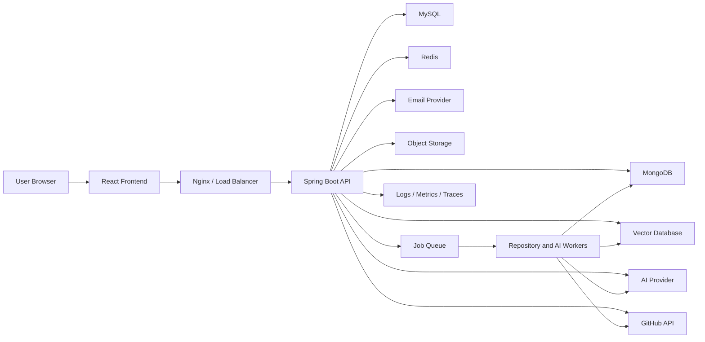
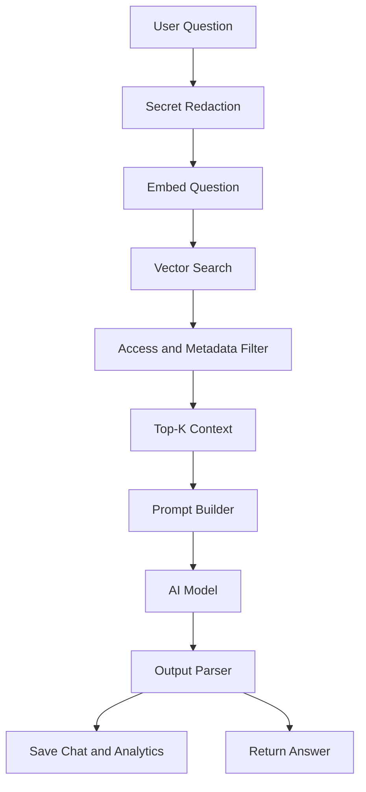
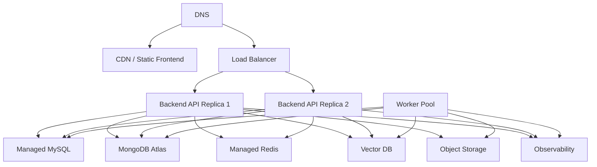

# CodePilot AI: Context-Aware Development Assistant and Engineering Workspace

Production-Grade Project Blueprint, Software Requirements Specification, System Design Document, and Development Roadmap

Version: 1.0  
Date: 2026-05-14  
Project Name: CodePilot AI  
Project Title: CodePilot AI: Context-Aware Development Assistant and Engineering Workspace

---

## 1. Executive Overview

### 1.1 Problem Statement

Modern software development requires developers to move across many disconnected tools: IDEs, Git providers, issue trackers, documentation systems, API clients, database consoles, AI chat tools, learning platforms, code quality scanners, and deployment dashboards. This fragmentation creates context switching, duplicated work, slower debugging, weaker onboarding, and inconsistent engineering practices.

Developers also increasingly use AI coding tools, but most tools operate with limited project context. They can answer isolated questions, but they often lack repository-wide understanding, architectural awareness, user-specific learning history, API testing context, database schema context, or long-term engineering memory.

CodePilot AI solves this by providing a unified developer workspace that combines:

- AI code understanding and generation
- Repository intelligence
- Full-stack project workspaces
- API development tools
- Database assistance
- DSA learning and personalized recommendations
- Analytics, monitoring, notifications, and admin controls

The product is designed as a production-grade full-stack platform that developers, students, teams, instructors, and engineering organizations can use to write, understand, improve, and manage code more effectively.

### 1.2 Existing Solutions and Limitations

| Existing Solution Type | Examples | Strengths | Limitations |
|---|---|---|---|
| AI coding assistants | GitHub Copilot, Cursor, ChatGPT, Codeium | Fast code generation, inline suggestions, chat-based help | Limited cross-feature workspace intelligence, weak learning analytics, no built-in API/database/project management system |
| IDEs | VS Code, IntelliJ IDEA, WebStorm | Powerful editing, debugging, extensions | Not designed as AI-first workspace, repository intelligence depends on plugins |
| API tools | Postman, Insomnia, Hoppscotch | Request testing, collections, environments | Separate from code understanding and AI debugging context |
| Code quality tools | SonarQube, CodeClimate | Static analysis, security checks | Usually not conversational, not integrated with learning or recommendations |
| Learning platforms | LeetCode, GeeksforGeeks, HackerRank | Practice problems, scoring | Weak integration with actual code projects and developer workspace |
| Repo analytics tools | GitHub Insights, GitLab Analytics | Commit and contributor metrics | Limited AI summarization, architecture detection, dependency reasoning |

### 1.3 Why CodePilot AI Is Needed

CodePilot AI is needed because developers need one workspace where code, context, intelligence, learning, debugging, and tooling work together. The product should reduce development friction by making the platform aware of:

- The current user
- Their projects
- Their repositories
- Their files
- Their coding habits
- Their API collections
- Their database schemas
- Their learning progress
- Their previous chats
- Their weak areas and recurring errors

This creates a durable engineering memory layer that improves recommendations and AI responses over time.

### 1.4 Goals

Primary goals:

- Provide a unified AI-powered developer workspace.
- Enable repository-aware code assistance.
- Help users understand, debug, refactor, document, and optimize code.
- Support developer learning through personalized DSA guidance.
- Provide API testing and database query assistance.
- Offer production-grade security, observability, scalability, and maintainability.
- Build a platform that can evolve into SaaS, team collaboration, IDE extensions, and enterprise tooling.

### 1.5 Objectives

Functional objectives:

- Users can sign up, log in, verify email, reset passwords, and manage profiles.
- Users can create projects and link GitHub repositories.
- Users can browse, upload, edit, and manage files in a project workspace.
- Users can request AI explanations, bug detection, refactoring, documentation, and optimization suggestions.
- Users can chat with an AI assistant that understands project and repository context.
- Users can receive DSA problem recommendations based on progress and weakness analysis.
- Users can scan repositories for summaries, dependencies, architecture, complexity, and risk.
- Users can build API requests, view responses, save collections, and inspect history.
- Users can generate SQL queries, optimize SQL queries, and receive schema suggestions.
- Admins can manage users, review analytics, inspect reports, and monitor system health.

Non-functional objectives:

- Secure authentication and authorization.
- Fast response time for normal APIs.
- Asynchronous processing for heavy AI and repository tasks.
- Horizontally scalable backend services.
- Reliable persistence using MySQL and MongoDB.
- Efficient caching using Redis.
- Observability using logs, metrics, traces, dashboards, and alerts.
- Accessible frontend with keyboard support and semantic HTML.

### 1.6 Target Audience

Primary users:

- Software developers
- Computer science students
- Self-taught programmers
- Backend engineers
- Frontend engineers
- Full-stack engineers
- DevOps engineers
- Engineering teams
- Coding instructors
- Bootcamp students
- Interview preparation users

Secondary users:

- Engineering managers
- Technical mentors
- Open-source maintainers
- Startup founders
- Developer tool researchers
- Admin users managing organizations

### 1.7 Side Income Potential

CodePilot AI can be monetized through:

- Freemium SaaS subscriptions
- Pro plans for individual developers
- Team plans for engineering teams
- Enterprise plans with private deployment
- Usage-based AI credits
- Paid repository scanning quota
- Premium DSA learning plans
- Premium API testing collections and environments
- Marketplace revenue share for plugins
- White-label deployments for institutes
- Paid IDE extensions
- Training analytics for colleges and bootcamps
- Sponsored developer learning paths

Example pricing model:

| Plan | Target User | Features |
|---|---|---|
| Free | Students, hobbyists | Limited projects, limited AI requests, limited repo scans |
| Pro | Individual developers | More AI credits, private projects, advanced code analysis |
| Team | Small teams | Shared workspaces, team analytics, role management |
| Enterprise | Companies | SSO, audit logs, private deployment, custom AI providers |

### 1.8 Unique Selling Points

- Repository-aware AI assistant instead of isolated AI chat.
- Combined developer workspace, API client, database assistant, and learning system.
- Personalized DSA recommendations tied to actual user progress.
- Architecture and dependency intelligence for linked repositories.
- Multi-database persistence optimized for structured and flexible developer data.
- Built-in admin, analytics, monitoring, and notification systems.
- Designed for extension into IDE plugins and team collaboration.
- AI workflows built around RAG, embeddings, repository parsing, and contextual memory.

### 1.9 Scope of Project

In scope:

- Web-based frontend using React and Bootstrap.
- Backend REST APIs using Spring Boot.
- JWT authentication and refresh tokens.
- OAuth login.
- User, role, project, repository, file, notification, learning, chat, API collection, analytics, and log modules.
- GitHub repository integration.
- AI code assistant.
- Repository scanning and summarization.
- DSA learning module.
- API testing tool.
- Database assistant.
- Redis caching.
- Dockerized deployment.
- CI/CD with GitHub Actions.
- Cloud deployment using containerized services.

Out of scope for initial release:

- Native desktop IDE replacement.
- Full browser-based terminal with arbitrary command execution.
- Production code execution sandbox for untrusted languages.
- Full Git write operations such as branch creation and commits.
- Real-time multiplayer editing.
- Mobile app.
- Plugin marketplace.

### 1.10 Future Scalability

The architecture must support:

- Horizontal scaling of backend API servers.
- Worker services for repository scanning and AI jobs.
- Separate AI orchestration service in later versions.
- Multi-tenant organizations.
- Enterprise SSO.
- Feature flags.
- Usage metering.
- Dedicated vector database cluster.
- Event-driven processing using Kafka or RabbitMQ.
- Microservice migration from modular monolith.
- IDE extension integration.

---

## 2. Functional Requirements

Each feature below includes purpose, user flow, inputs, outputs, dependencies, APIs, database interactions, internal logic, edge cases, security, and performance considerations.

### 2.1 Authentication and User Management

#### Feature: Signup

Purpose:

Allow a new user to create an account using name, email, password, and optional profile metadata.

User flow:

1. User opens signup page.
2. User enters full name, email, password, and confirm password.
3. Frontend validates required fields, password strength, and email format.
4. Backend checks if email already exists.
5. Backend hashes password using BCrypt.
6. Backend creates user with `EMAIL_UNVERIFIED` status.
7. Backend assigns default `ROLE_USER`.
8. Backend creates email verification token.
9. Email service sends verification email.
10. Frontend shows success message.

Inputs:

- fullName
- email
- password
- confirmPassword
- optional username
- optional timezone

Outputs:

- userId
- email
- verificationRequired boolean
- message

Dependencies:

- MySQL Users table
- Roles table
- Email service
- Spring Security password encoder
- Redis optional rate limiter

APIs required:

- `POST /api/v1/auth/signup`

Database interactions:

- Read `users` by email.
- Insert into `users`.
- Insert into `user_roles`.
- Insert verification token into `email_verification_tokens`.

Internal logic:

```java
public AuthResponse signup(SignupRequest request) {
    validateSignup(request);
    if (userRepository.existsByEmail(request.email())) {
        throw new ConflictException("Email already registered");
    }

    Role userRole = roleRepository.findByName("ROLE_USER")
        .orElseThrow(() -> new ConfigurationException("Default role missing"));

    User user = User.builder()
        .fullName(request.fullName())
        .email(request.email().toLowerCase())
        .passwordHash(passwordEncoder.encode(request.password()))
        .status(UserStatus.EMAIL_UNVERIFIED)
        .enabled(true)
        .build();

    user.addRole(userRole);
    userRepository.save(user);
    verificationService.issueEmailVerification(user);
    return AuthResponse.pendingVerification(user.getId(), user.getEmail());
}
```

Edge cases:

- Duplicate email.
- Password and confirm password mismatch.
- Weak password.
- Disposable email domain if blocked by policy.
- Email provider failure after user creation.
- User signs up while previous unverified account exists.
- Race condition with simultaneous signup requests using same email.

Security considerations:

- Store only password hash, never plaintext.
- Normalize email to lowercase.
- Rate-limit signup attempts by IP and email.
- Use generic error messaging where account enumeration risk exists.
- Verification tokens must be random, single-use, and expiring.
- Validate all inputs server-side.

Performance considerations:

- Add unique index on `users.email`.
- Send email asynchronously where possible.
- Avoid synchronous heavy profile initialization.

#### Feature: Login

Purpose:

Authenticate a user and issue access and refresh tokens.

User flow:

1. User enters email and password.
2. Backend validates credentials.
3. Backend verifies user is enabled and email is verified if required.
4. Backend issues JWT access token and refresh token.
5. Refresh token is stored server-side with rotation metadata.
6. Frontend stores access token in memory or secure storage; refresh token should preferably be HttpOnly secure cookie.

Inputs:

- email
- password
- rememberMe optional

Outputs:

- accessToken
- refreshToken cookie or token string
- expiresIn
- user profile
- roles

Dependencies:

- Spring Security AuthenticationManager
- JWT service
- Refresh token table
- Redis login rate limiter

APIs:

- `POST /api/v1/auth/login`

Database interactions:

- Read `users` by email.
- Read roles.
- Insert refresh token.
- Update last login timestamp.

Internal logic:

```java
public LoginResponse login(LoginRequest request, String userAgent, String ip) {
    rateLimiter.check("login:" + request.email(), ip);
    Authentication auth = authenticationManager.authenticate(
        new UsernamePasswordAuthenticationToken(request.email(), request.password())
    );

    UserPrincipal principal = (UserPrincipal) auth.getPrincipal();
    User user = userRepository.findById(principal.getId())
        .orElseThrow(() -> new UnauthorizedException("Invalid credentials"));

    if (!user.isEnabled() || user.getStatus() == UserStatus.SUSPENDED) {
        throw new ForbiddenException("Account is not active");
    }

    String accessToken = jwtService.generateAccessToken(user);
    RefreshToken refreshToken = refreshTokenService.create(user, userAgent, ip);
    userRepository.updateLastLogin(user.getId(), Instant.now());
    return LoginResponse.of(accessToken, refreshToken.getToken(), user);
}
```

Edge cases:

- Invalid password.
- Unverified email.
- Suspended account.
- Too many login attempts.
- Expired password reset state.
- User has no roles due to corrupted data.

Security considerations:

- Use BCrypt or Argon2.
- Add rate limiting.
- Log failed attempts without storing passwords.
- Use secure, HttpOnly, SameSite cookies for refresh token when browser-based.
- Rotate refresh tokens.

Performance considerations:

- Cache user role permissions briefly after successful login.
- Avoid loading large profile payload during login.

#### Feature: JWT Authentication

Purpose:

Protect API endpoints using stateless access tokens.

User flow:

1. Frontend sends access token in `Authorization: Bearer <token>`.
2. JWT filter validates signature, expiration, issuer, audience, and claims.
3. Filter loads user details or uses token claims plus permission cache.
4. Security context is populated.
5. Controller executes if authorized.

Inputs:

- Authorization header

Outputs:

- Authenticated request context
- 401 if invalid token
- 403 if insufficient permission

Dependencies:

- JWT signing key or asymmetric key pair
- Spring Security filter chain
- UserDetailsService
- Redis optional token denylist

APIs:

- Used implicitly for all protected APIs.

Database interactions:

- Optional user lookup.
- Optional token version validation.

Internal logic:

```java
protected void doFilterInternal(HttpServletRequest request,
                                HttpServletResponse response,
                                FilterChain chain) throws IOException, ServletException {
    String token = bearerTokenResolver.resolve(request);
    if (token != null && jwtService.isValid(token)) {
        Long userId = jwtService.extractUserId(token);
        UserDetails userDetails = userDetailsService.loadUserById(userId);
        UsernamePasswordAuthenticationToken auth =
            new UsernamePasswordAuthenticationToken(userDetails, null, userDetails.getAuthorities());
        SecurityContextHolder.getContext().setAuthentication(auth);
    }
    chain.doFilter(request, response);
}
```

Edge cases:

- Expired token.
- Token with invalid signature.
- Token generated before password change.
- Revoked user still has token.
- Clock skew.

Security considerations:

- Short access token expiry, for example 15 minutes.
- Refresh token rotation.
- Include token version or passwordChangedAt validation.
- Do not store sensitive data in JWT claims.

Performance considerations:

- Use cached public key or secret.
- Cache user authority lookup.

#### Feature: OAuth Login

Purpose:

Allow users to authenticate using providers such as GitHub and Google.

User flow:

1. User clicks "Continue with GitHub" or "Continue with Google".
2. Frontend redirects to backend OAuth authorization endpoint.
3. Provider authenticates user.
4. Provider redirects back with authorization code.
5. Backend exchanges code for provider access token.
6. Backend fetches provider user profile.
7. Backend links to existing account or creates new OAuth user.
8. Backend issues CodePilot tokens.

Inputs:

- OAuth provider
- authorization code
- state

Outputs:

- CodePilot access and refresh tokens
- linked provider metadata

Dependencies:

- OAuth provider configuration
- Spring Security OAuth2 Client
- Users table
- OAuth accounts table

APIs:

- `GET /oauth2/authorization/{provider}`
- `GET /login/oauth2/code/{provider}`
- `POST /api/v1/auth/oauth/token` for frontend-driven flows if required

Database interactions:

- Read or create user.
- Insert or update OAuth account.
- Create refresh token.

Edge cases:

- Provider email not verified.
- Provider returns no email.
- Existing email/password account uses same email.
- User denies OAuth permission.
- OAuth state mismatch.

Security considerations:

- Validate state parameter.
- Use PKCE for public clients.
- Store provider tokens encrypted if long-lived access is needed.
- Never expose provider access token to frontend unless required.

Performance considerations:

- Provider API calls should have timeouts.
- Cache provider metadata only where safe.

#### Feature: Forgot Password

Purpose:

Allow users to reset forgotten passwords securely.

User flow:

1. User submits email.
2. Backend always returns generic success response.
3. If account exists, backend creates password reset token.
4. Email service sends reset link.
5. User opens reset page.
6. User enters new password.
7. Backend validates token and updates password hash.
8. Backend revokes existing refresh tokens.

Inputs:

- email
- resetToken
- newPassword
- confirmPassword

Outputs:

- success message

Dependencies:

- Email service
- Password reset token table
- Refresh token service

APIs:

- `POST /api/v1/auth/forgot-password`
- `POST /api/v1/auth/reset-password`

Database interactions:

- Read user by email.
- Insert reset token hash.
- Update password hash.
- Revoke refresh tokens.

Edge cases:

- Email does not exist.
- Expired token.
- Token already used.
- New password same as old password.
- Multiple reset requests.

Security considerations:

- Store reset token hash, not plaintext token.
- Use generic forgot-password response.
- Expire tokens quickly, for example 15-30 minutes.
- Revoke sessions after reset.

Performance considerations:

- Asynchronous email dispatch.
- Rate limit reset requests.

#### Feature: Email Verification

Purpose:

Verify ownership of a user's email address.

User flow:

1. User receives verification link.
2. User clicks link.
3. Backend validates token.
4. Backend updates user status to active.
5. Token is marked consumed.

Inputs:

- verification token

Outputs:

- verification result

Dependencies:

- Email verification token table
- Email service

APIs:

- `GET /api/v1/auth/verify-email?token=...`
- `POST /api/v1/auth/resend-verification`

Database interactions:

- Read token hash.
- Update user status.
- Mark token consumed.

Edge cases:

- Token expired.
- Token reused.
- Already verified account.
- Resend throttling.

Security considerations:

- Single-use tokens.
- Token hash in database.
- Rate limit resend requests.

Performance considerations:

- Index token hash.

#### Feature: Role-Based Access

Purpose:

Control access to system features by user role and permission.

Roles:

- `ROLE_USER`
- `ROLE_PRO_USER`
- `ROLE_TEAM_ADMIN`
- `ROLE_ADMIN`
- `ROLE_SUPER_ADMIN`

Permissions:

- `PROJECT_READ`
- `PROJECT_WRITE`
- `REPOSITORY_SCAN`
- `AI_CHAT`
- `API_COLLECTION_WRITE`
- `ADMIN_USER_READ`
- `ADMIN_USER_WRITE`
- `ANALYTICS_READ`
- `SYSTEM_MONITOR_READ`

User flow:

1. User logs in.
2. JWT contains role claim or user ID.
3. Backend resolves permissions.
4. Protected endpoints enforce method-level authorization.

Inputs:

- authenticated user
- requested endpoint

Outputs:

- access granted or denied

Dependencies:

- Roles table
- Permissions table
- Spring Security

APIs:

- `GET /api/v1/users/me/permissions`
- Admin role APIs

Database interactions:

- Read user roles.
- Read role permissions.

Edge cases:

- User role changed while token active.
- Missing default role.
- Admin accidentally removes own role.

Security considerations:

- Enforce authorization server-side.
- Never rely on frontend-hidden UI for access control.
- Audit admin permission changes.

Performance considerations:

- Cache permissions in Redis by user ID and token version.

#### Feature: Profile Management

Purpose:

Allow users to manage personal information and preferences.

User flow:

1. User opens profile page.
2. User updates display name, avatar, bio, timezone, theme, and notification preferences.
3. Backend validates and saves profile.

Inputs:

- fullName
- username
- bio
- avatarUrl or file
- timezone
- theme
- notification preferences

Outputs:

- updated profile

Dependencies:

- User profile table or Users columns
- File storage for avatar

APIs:

- `GET /api/v1/users/me`
- `PATCH /api/v1/users/me`
- `POST /api/v1/users/me/avatar`

Database interactions:

- Read/update Users.
- Optional file metadata insert.

Edge cases:

- Duplicate username.
- Invalid avatar type.
- Large avatar file.
- Profanity or unsafe profile fields.

Security considerations:

- Validate file type by content.
- Sanitize bio.
- Restrict avatar size.
- Authenticated user may only update own profile unless admin.

Performance considerations:

- Serve avatars through CDN or object storage.
- Cache profile response briefly.

### 2.2 Developer Workspace

#### Feature: Dashboard

Purpose:

Provide a personalized overview of projects, repository scans, AI usage, learning progress, API activity, notifications, and recent work.

User flow:

1. User logs in.
2. Dashboard loads summary cards.
3. User can open a recent project, continue AI chat, view recommendations, or inspect alerts.

Inputs:

- authenticated user ID
- optional date range

Outputs:

- project count
- recent projects
- repository scan statuses
- AI request usage
- DSA progress
- API test history summary
- notifications

Dependencies:

- Project service
- Repository service
- Analytics service
- Learning service
- Notification service

APIs:

- `GET /api/v1/dashboard/summary`

Database interactions:

- Aggregate from projects, repositories, analytics, learning progress, notifications.

Internal logic:

```java
public DashboardSummary getSummary(Long userId) {
    return DashboardSummary.builder()
        .projectStats(projectService.getStats(userId))
        .recentProjects(projectService.getRecent(userId, 5))
        .repoStats(repositoryService.getScanStats(userId))
        .learningStats(learningService.getSummary(userId))
        .aiUsage(analyticsService.getAiUsage(userId, LocalDate.now().minusDays(30)))
        .notifications(notificationService.getUnread(userId, 10))
        .build();
}
```

Edge cases:

- New user with no data.
- Analytics service unavailable.
- Long-running repo scans still pending.

Security considerations:

- Only return resources owned by user or shared with user.

Performance considerations:

- Cache dashboard summary for 30-120 seconds.
- Use precomputed analytics where possible.

#### Feature: Project Workspace

Purpose:

Provide a central workspace for code files, repository context, AI chat, analytics, API collections, and database assistant sessions.

User flow:

1. User creates or opens project.
2. Workspace displays file tree, editor, AI panel, activity panel, and project metadata.
3. User edits files, asks AI questions, links repositories, and views insights.

Inputs:

- projectId
- project metadata
- linked repository optional

Outputs:

- workspace model with project, files, chats, analytics, repository status

Dependencies:

- Project service
- File service
- AI service
- Repository service

APIs:

- `POST /api/v1/projects`
- `GET /api/v1/projects/{projectId}`
- `PATCH /api/v1/projects/{projectId}`
- `DELETE /api/v1/projects/{projectId}`
- `GET /api/v1/projects/{projectId}/workspace`

Database interactions:

- CRUD Projects.
- Read Files.
- Read ChatHistory.
- Read Repository scan state.

Edge cases:

- Deleted project opened in another tab.
- User lacks permission.
- Project has many files.

Security considerations:

- Enforce ownership or collaboration permissions.
- Audit project deletion.

Performance considerations:

- Paginate large file lists.
- Lazy-load code file content.

#### Feature: Code Editor

Purpose:

Allow users to view and edit files in the browser.

User flow:

1. User selects a file from file tree.
2. Editor loads file content.
3. User edits content.
4. Autosave or manual save updates backend.
5. User can invoke AI actions on selected code.

Inputs:

- fileId
- file content
- cursor selection
- language

Outputs:

- saved file version
- editor diagnostics
- AI suggestions

Dependencies:

- Monaco Editor or CodeMirror
- File service
- AI assistant service

APIs:

- `GET /api/v1/files/{fileId}`
- `PUT /api/v1/files/{fileId}/content`
- `POST /api/v1/ai/code/explain`
- `POST /api/v1/ai/code/refactor`

Database interactions:

- Read/update Files.
- Insert file version or audit log.

Internal logic:

- Detect language from extension.
- Load syntax highlighter.
- Track dirty state.
- Save with optimistic locking using file version.
- Send selected code plus file context to AI endpoint.

Edge cases:

- File changed in another session.
- Binary file opened.
- Very large file.
- Invalid encoding.

Security considerations:

- Validate file ownership.
- Limit file size.
- Sanitize rendered markdown/docs output.

Performance considerations:

- Do not load huge files fully in editor.
- Use debounce for autosave.
- Compress large responses.

#### Feature: File Management

Purpose:

Allow creating, uploading, renaming, moving, deleting, and organizing project files.

User flow:

1. User opens file explorer.
2. User creates folder or file.
3. User uploads files.
4. User renames or deletes files.

Inputs:

- file name
- path
- parent folder ID
- content or uploaded file

Outputs:

- updated file tree

Dependencies:

- File metadata table
- Object storage or database file content

APIs:

- `POST /api/v1/projects/{projectId}/files`
- `POST /api/v1/projects/{projectId}/files/upload`
- `PATCH /api/v1/files/{fileId}`
- `DELETE /api/v1/files/{fileId}`
- `GET /api/v1/projects/{projectId}/files/tree`

Database interactions:

- Insert/update/delete Files.
- Store file content in MongoDB or object storage.

Edge cases:

- Duplicate path.
- Invalid path traversal.
- Unsupported file type.
- File too large.

Security considerations:

- Prevent `../` path traversal.
- Content-type validation.
- Malware scan for uploaded archives in enterprise version.

Performance considerations:

- Store large content outside MySQL.
- Use file tree caching.

#### Feature: Repository Linking

Purpose:

Link a CodePilot project to a GitHub repository for scanning and repository intelligence.

User flow:

1. User clicks link repository.
2. User authenticates GitHub if not already connected.
3. User selects repository.
4. Backend saves repository metadata.
5. User starts repository scan.

Inputs:

- GitHub installation or OAuth token
- repository owner
- repository name
- branch

Outputs:

- linked repository record
- scan status

Dependencies:

- GitHub OAuth/App integration
- Repository service
- Repository scanner worker

APIs:

- `GET /api/v1/integrations/github/repositories`
- `POST /api/v1/projects/{projectId}/repositories/link`

Database interactions:

- Insert Repositories.
- Store encrypted GitHub token reference if needed.

Edge cases:

- Private repo without permission.
- Repo deleted on GitHub.
- Branch missing.
- Token expired.

Security considerations:

- Encrypt GitHub tokens.
- Request least privilege scopes.
- Do not expose repository secrets in AI prompts.

Performance considerations:

- Fetch repository metadata lazily.
- Queue deep scans asynchronously.

#### Feature: Project Analytics

Purpose:

Provide metrics about project activity, file changes, AI usage, repository health, and learning interactions.

User flow:

1. User opens analytics tab.
2. User selects date range.
3. System displays activity charts and insights.

Inputs:

- projectId
- date range
- metric type

Outputs:

- chart data
- usage metrics
- recommendations

Dependencies:

- Analytics table
- Logging/event pipeline

APIs:

- `GET /api/v1/projects/{projectId}/analytics`

Database interactions:

- Read aggregated analytics.
- Write analytics events during user actions.

Edge cases:

- No data.
- Invalid date range.
- Large event volume.

Security considerations:

- Project analytics visible only to permitted users.

Performance considerations:

- Pre-aggregate daily metrics.
- Cache common ranges.

### 2.3 AI Code Assistant

#### Feature: Code Explanation

Purpose:

Explain code in natural language with awareness of language, file path, project context, and selected lines.

User flow:

1. User selects code.
2. User clicks Explain.
3. Frontend sends selected code, file metadata, project ID, and optional question.
4. Backend retrieves relevant context from files and embeddings.
5. AI returns explanation with key behavior, dependencies, risks, and examples.

Inputs:

- projectId
- fileId
- selected code
- language
- question optional

Outputs:

- explanation
- referenced files
- concepts detected

Dependencies:

- AI provider
- Embedding service
- Vector database
- File service
- Prompt service

APIs:

- `POST /api/v1/ai/code/explain`

Database interactions:

- Read project and file.
- Read vector search results.
- Insert ChatHistory or AI interaction record.
- Insert Analytics event.

Internal logic:

```java
public AiCodeResponse explain(CodeExplainRequest request, Long userId) {
    accessService.assertProjectRead(userId, request.projectId());
    CodeContext context = contextBuilder.buildForFileSelection(
        request.projectId(), request.fileId(), request.selectedCode()
    );
    Prompt prompt = promptFactory.codeExplanation(context, request.question());
    AiCompletion completion = aiClient.complete(prompt);
    chatHistoryService.saveAiInteraction(userId, request.projectId(), "CODE_EXPLAIN", prompt, completion);
    return AiCodeResponse.from(completion, context.references());
}
```

Edge cases:

- Code too long for model context.
- Unsupported language.
- Selected code depends on missing file.
- AI provider timeout.
- Unsafe prompt injection in code comments.

Security considerations:

- Redact secrets before sending to AI.
- Apply prompt injection guardrails.
- Enforce AI usage quota.
- Do not train public models on private user code unless explicitly allowed.

Performance considerations:

- Use streaming responses.
- Cache embeddings.
- Truncate context by relevance.

#### Feature: Bug Detection

Purpose:

Identify likely defects, runtime errors, security bugs, and logical mistakes.

User flow:

1. User selects file or code block.
2. User clicks Detect Bugs.
3. Backend runs static heuristics and AI review.
4. System returns findings with severity, line reference, explanation, and suggested fix.

Inputs:

- projectId
- fileId
- code
- language

Outputs:

- list of findings
- severity
- suggested fixes
- confidence

Dependencies:

- Static analyzers where available
- AI provider
- Vector context

APIs:

- `POST /api/v1/ai/code/bugs`

Database interactions:

- Store AI result.
- Store analytics event.

Internal logic:

- Run lightweight syntax/static checks.
- Retrieve related definitions.
- Ask AI to produce structured JSON findings.
- Validate AI JSON schema.
- Return normalized findings.

Edge cases:

- False positives.
- AI returns invalid JSON.
- Very large file.
- Generated code or minified code.

Security considerations:

- Treat AI findings as advisory.
- Avoid exposing secret values in reports.

Performance considerations:

- Use async job for full repository bug scan.

#### Feature: Complexity Analysis

Purpose:

Analyze time complexity, space complexity, cyclomatic complexity, maintainability, and readability.

User flow:

1. User selects code.
2. User clicks Analyze Complexity.
3. System identifies loops, recursion, data structures, function calls, and control paths.
4. AI explains complexity and improvement options.

Inputs:

- code
- language
- function name optional

Outputs:

- time complexity
- space complexity
- cyclomatic complexity estimate
- maintainability concerns
- optimization ideas

Dependencies:

- Parser/static analyzer optional
- AI service

APIs:

- `POST /api/v1/ai/code/complexity`

Database interactions:

- Store interaction.

Edge cases:

- Indirect function complexity unknown.
- Dynamic language constructs.
- External API/database calls.

Security considerations:

- Validate input size.

Performance considerations:

- Synchronous for small code blocks, async for full files.

#### Feature: Refactoring Suggestions

Purpose:

Suggest safer, clearer, more maintainable code transformations.

User flow:

1. User selects code.
2. User clicks Refactor.
3. User optionally chooses goal: readability, performance, security, design pattern, reduce duplication.
4. AI returns patch-style suggestion and explanation.

Inputs:

- code
- language
- goal
- constraints

Outputs:

- refactored code
- diff
- explanation
- risk notes

Dependencies:

- AI provider
- Diff generator

APIs:

- `POST /api/v1/ai/code/refactor`

Database interactions:

- Save AI interaction.
- Optional save accepted refactor event.

Edge cases:

- Refactor changes behavior.
- Missing tests.
- Code has external dependencies.

Security considerations:

- Avoid automatically applying changes without user confirmation.

Performance considerations:

- Stream response.

#### Feature: Documentation Generation

Purpose:

Generate comments, README sections, API docs, function docs, and architecture descriptions.

User flow:

1. User selects code or project.
2. User selects doc type.
3. AI creates documentation.
4. User reviews and inserts into file or exports.

Inputs:

- code
- project metadata
- doc type
- style

Outputs:

- generated documentation

Dependencies:

- AI provider
- Repository context

APIs:

- `POST /api/v1/ai/code/document`

Database interactions:

- Save generated document result.

Edge cases:

- Incomplete code.
- Existing docs conflict.

Security considerations:

- Do not include secrets.

Performance considerations:

- Async generation for full README.

#### Feature: Code Optimization

Purpose:

Improve performance, memory usage, query efficiency, and algorithmic design.

User flow:

1. User submits code.
2. System analyzes bottlenecks.
3. AI proposes optimized alternatives.
4. User reviews complexity comparison.

Inputs:

- code
- language
- performance goal

Outputs:

- optimized code
- complexity before/after
- trade-offs

Dependencies:

- AI provider
- Complexity analyzer

APIs:

- `POST /api/v1/ai/code/optimize`

Database interactions:

- Save interaction.

Edge cases:

- Optimization reduces readability.
- Micro-optimization not useful.

Security considerations:

- Do not automatically execute user code.

Performance considerations:

- Keep model prompt focused.

#### Feature: AI Chat Assistant

Purpose:

Provide conversational assistance with memory, project context, repository context, and user history.

User flow:

1. User opens AI chat panel.
2. User asks a question.
3. Backend retrieves relevant project files, repository summaries, previous chat history, and learning context.
4. AI responds with actionable guidance.
5. Chat is saved.

Inputs:

- message
- projectId optional
- repositoryId optional
- chatSessionId
- selected file optional

Outputs:

- assistant message
- cited context files
- suggested actions

Dependencies:

- ChatHistory MongoDB collection
- Vector database
- AI service
- Context retrieval service

APIs:

- `POST /api/v1/ai/chat`
- `GET /api/v1/ai/chat/sessions`
- `GET /api/v1/ai/chat/sessions/{id}`

Database interactions:

- Read/write ChatHistory.
- Read project metadata.
- Read vector context.

Edge cases:

- User asks unrelated question.
- Context exceeds model limit.
- AI provider fails.
- Chat session deleted.

Security considerations:

- Access check project context before retrieval.
- Redact secrets.
- Rate limit.

Performance considerations:

- Streaming response.
- Cache frequent context chunks.

### 2.4 DSA Learning Module

#### Feature: Personalized Problem Recommendations

Purpose:

Recommend DSA problems based on topic mastery, difficulty history, solved/failed attempts, time spent, and weak areas.

User flow:

1. User opens DSA module.
2. System analyzes learning progress.
3. User receives recommended problems.
4. User attempts challenge and marks outcome.
5. System updates recommendation model.

Inputs:

- userId
- solved problems
- topic history
- difficulty preference
- time availability

Outputs:

- ranked recommendations
- reason for recommendation
- expected difficulty

Dependencies:

- LearningProgress table
- ProblemRecommendations table
- Problem catalog

APIs:

- `GET /api/v1/learning/recommendations`
- `POST /api/v1/learning/problems/{problemId}/attempt`

Database interactions:

- Read progress.
- Insert recommendations.
- Update attempt records.

Internal logic:

```java
double scoreProblem(UserProgress progress, Problem problem) {
    double weakTopicBoost = progress.weakTopics().contains(problem.topic()) ? 0.35 : 0.0;
    double difficultyFit = 1.0 - Math.abs(progress.targetDifficulty() - problem.difficultyScore());
    double novelty = progress.hasSolved(problem.id()) ? -1.0 : 0.2;
    double spacedRepetition = progress.needsReview(problem.topic()) ? 0.25 : 0.0;
    return weakTopicBoost + difficultyFit + novelty + spacedRepetition;
}
```

Edge cases:

- New user has no history.
- User only solves one topic.
- User marks inaccurate outcome.

Security considerations:

- Users can only update own progress.

Performance considerations:

- Precompute recommendations daily.

#### Feature: Topic Analysis

Purpose:

Show strengths and weaknesses by topic.

Inputs:

- userId
- date range

Outputs:

- topic mastery score
- solved count
- failed count
- average time
- trend

APIs:

- `GET /api/v1/learning/topics/analysis`

Internal logic:

- Mastery score combines success rate, difficulty, recency, and consistency.
- Example formula:

```text
mastery = 0.45 * successRate
        + 0.25 * averageDifficultyNormalized
        + 0.20 * recencyScore
        + 0.10 * consistencyScore
```

Edge cases:

- No attempts in date range.
- Topic has too few samples.

#### Feature: Weak Area Detection

Purpose:

Identify topics and patterns where the user struggles.

Logic:

- Detect high failure rate.
- Detect long solve time.
- Detect frequent hint usage.
- Detect regression after previous mastery.
- Detect skipped daily challenges.

Outputs:

- weak topics
- suggested revision path
- confidence score

APIs:

- `GET /api/v1/learning/weak-areas`

#### Feature: Progress Tracking

Purpose:

Track solved problems, streaks, topic mastery, difficulty progression, and learning milestones.

APIs:

- `GET /api/v1/learning/progress`
- `POST /api/v1/learning/progress`

Database interactions:

- Update LearningProgress.
- Insert Analytics event.

#### Feature: Daily Challenges

Purpose:

Provide one or more daily DSA tasks based on user level.

Logic:

- Select problem based on target difficulty.
- Prioritize weak topics.
- Avoid repeats.
- Include one review problem every few days.

APIs:

- `GET /api/v1/learning/daily-challenge`
- `POST /api/v1/learning/daily-challenge/{id}/complete`

#### Feature: Difficulty Prediction

Purpose:

Predict whether a problem is easy, medium, or hard for the current user.

Logic:

- Use problem global difficulty.
- Adjust by user topic mastery.
- Adjust by recent performance.
- Adjust by problem tags and similar solved problems.

Output:

- predicted difficulty
- confidence
- reason

### 2.5 Repository Intelligence

#### Feature: GitHub Integration

Purpose:

Connect user GitHub accounts and read repositories for analysis.

APIs:

- `GET /api/v1/integrations/github/connect`
- `GET /api/v1/integrations/github/callback`
- `GET /api/v1/integrations/github/repositories`
- `POST /api/v1/integrations/github/disconnect`

Security:

- Use OAuth state validation.
- Store tokens encrypted.
- Support token revocation.
- Request minimal scopes.

#### Feature: Repository Scanning

Purpose:

Scan repository files, languages, dependencies, architecture, README, package files, source files, and configuration.

User flow:

1. User starts scan.
2. Backend creates scan job.
3. Worker clones or downloads repository.
4. Worker filters ignored files.
5. Worker extracts metadata.
6. Worker chunks files and generates embeddings.
7. Worker saves summaries and scan status.

Inputs:

- repositoryId
- branch
- scan depth

Outputs:

- scan status
- file index
- dependency graph
- architecture summary
- embeddings

Dependencies:

- GitHub API
- Worker queue
- Vector database
- MongoDB for scan documents

APIs:

- `POST /api/v1/repositories/{id}/scan`
- `GET /api/v1/repositories/{id}/scan-status`

Edge cases:

- Very large repository.
- Binary files.
- Generated files.
- Token expired.
- Repository contains secrets.

Security:

- Secret redaction.
- Private repo access isolation.
- Delete temporary clones after scan.

Performance:

- Async queue.
- File size limits.
- Incremental scans by commit SHA.

#### Feature: Repository Summarization

Purpose:

Generate understandable summaries at repository, folder, and file levels.

Logic:

- Parse README first.
- Identify package managers.
- Identify app entry points.
- Summarize major folders.
- Summarize important files.
- Generate architecture overview.

APIs:

- `GET /api/v1/repositories/{id}/summary`

#### Feature: Dependency Analysis

Purpose:

Identify dependencies, versions, licenses, vulnerabilities, and unused or outdated packages.

Inputs:

- package.json
- pom.xml
- build.gradle
- requirements.txt
- Dockerfile
- lock files

Outputs:

- dependencies
- versions
- ecosystem
- risks
- update suggestions

APIs:

- `GET /api/v1/repositories/{id}/dependencies`

#### Feature: Architecture Detection

Purpose:

Infer architectural style and major components.

Detection examples:

- React frontend
- Spring Boot backend
- REST API
- MVC layers
- Microservices
- Monorepo
- Dockerized app
- Database layer
- CI/CD pipeline

APIs:

- `GET /api/v1/repositories/{id}/architecture`

#### Feature: Repository Chat Assistant

Purpose:

Allow users to ask questions about repository structure and behavior.

APIs:

- `POST /api/v1/repositories/{id}/chat`

Logic:

- Query vector database using user question.
- Retrieve relevant code chunks.
- Retrieve repository summary.
- Generate answer with cited file paths.

### 2.6 API Developer Tools

#### Feature: API Testing Tool

Purpose:

Allow users to send HTTP requests and inspect responses.

User flow:

1. User opens API tool.
2. User selects method and URL.
3. User adds headers, query params, auth, and body.
4. User sends request.
5. Backend proxy executes request if allowed.
6. Response viewer shows status, headers, body, timing, and size.

Inputs:

- method
- URL
- headers
- params
- body
- auth config

Outputs:

- status code
- response headers
- response body
- response time
- request history entry

Dependencies:

- HTTP client service
- APICollections table
- History collection

APIs:

- `POST /api/v1/api-tools/send`

Security:

- Prevent SSRF.
- Block internal IP ranges by default.
- Validate URL scheme.
- Limit response size.
- Mask sensitive headers.

Performance:

- Timeouts.
- Streaming response size cap.

#### Feature: Request Builder

Purpose:

Create and edit API requests.

APIs:

- `POST /api/v1/api-tools/collections/{collectionId}/requests`
- `PATCH /api/v1/api-tools/requests/{requestId}`

#### Feature: Response Viewer

Purpose:

Display formatted response JSON, text, HTML preview, headers, cookies, timing, and size.

Frontend logic:

- Pretty-print JSON.
- Syntax highlight response.
- Show raw and formatted tabs.
- Show error details.

#### Feature: Collections

Purpose:

Group API requests by project or user.

APIs:

- `GET /api/v1/api-tools/collections`
- `POST /api/v1/api-tools/collections`
- `GET /api/v1/api-tools/collections/{id}`
- `PATCH /api/v1/api-tools/collections/{id}`
- `DELETE /api/v1/api-tools/collections/{id}`

#### Feature: History Management

Purpose:

Store recent API requests and responses metadata.

APIs:

- `GET /api/v1/api-tools/history`
- `DELETE /api/v1/api-tools/history/{id}`
- `DELETE /api/v1/api-tools/history`

### 2.7 Database Assistant

#### Feature: SQL Query Generator

Purpose:

Generate SQL from natural language and schema context.

Inputs:

- natural language request
- database dialect
- schema metadata

Outputs:

- SQL query
- explanation
- assumptions

APIs:

- `POST /api/v1/db-assistant/sql/generate`

Security:

- Do not execute generated SQL automatically.
- Warn on destructive queries.

#### Feature: Query Optimization

Purpose:

Suggest indexes, query rewrites, joins, and execution improvements.

Inputs:

- SQL query
- schema
- optional EXPLAIN plan

Outputs:

- optimized SQL
- index recommendations
- explanation

APIs:

- `POST /api/v1/db-assistant/sql/optimize`

#### Feature: Schema Suggestion

Purpose:

Suggest normalized tables, columns, indexes, and relationships from requirements.

Inputs:

- domain description
- entities
- expected queries
- database choice

Outputs:

- schema proposal
- SQL DDL
- relationship explanation

APIs:

- `POST /api/v1/db-assistant/schema/suggest`

### 2.8 Notifications System

#### Feature: Real-Time Notifications

Purpose:

Notify users about AI job completion, repository scans, daily challenges, security alerts, and admin messages.

Implementation:

- WebSocket or Server-Sent Events.
- Redis Pub/Sub for multi-instance broadcast.

APIs:

- `GET /api/v1/notifications`
- `PATCH /api/v1/notifications/{id}/read`
- `PATCH /api/v1/notifications/read-all`
- `GET /api/v1/notifications/stream`

#### Feature: Email Notifications

Purpose:

Send important events by email.

Events:

- Email verification.
- Password reset.
- Repository scan complete.
- Security login alert.
- Weekly learning summary.

#### Feature: System Alerts

Purpose:

Notify admins about system health, failed jobs, high AI spend, high error rate, and suspicious activity.

### 2.9 Admin Dashboard

#### Feature: User Management

Purpose:

Admins can view, search, suspend, activate, and assign roles.

APIs:

- `GET /api/v1/admin/users`
- `GET /api/v1/admin/users/{id}`
- `PATCH /api/v1/admin/users/{id}/status`
- `PATCH /api/v1/admin/users/{id}/roles`

Security:

- Admin-only endpoints.
- Audit every admin action.

#### Feature: Analytics

Purpose:

Admins can inspect product usage, active users, AI requests, repository scans, API tool usage, and learning usage.

APIs:

- `GET /api/v1/admin/analytics/overview`
- `GET /api/v1/admin/analytics/ai-usage`
- `GET /api/v1/admin/analytics/users`

#### Feature: Reports

Purpose:

Generate reports on usage, errors, abuse, subscription activity, and system performance.

APIs:

- `POST /api/v1/admin/reports`
- `GET /api/v1/admin/reports/{id}`

#### Feature: Monitoring

Purpose:

Admin dashboard displays health, uptime, queue status, cache status, database status, and AI provider availability.

APIs:

- `GET /api/v1/admin/monitoring/health`
- `GET /api/v1/admin/monitoring/jobs`
- `GET /api/v1/admin/monitoring/errors`

---

## 3. Non-Functional Requirements

### 3.1 Performance Requirements

- Authentication APIs should respond within 300 ms p95 under normal load excluding email provider latency.
- Dashboard summary should respond within 500 ms p95 using caching and aggregation.
- File content fetch for files under 1 MB should respond within 300 ms p95.
- AI chat first token should stream within 3 seconds p95 when provider is healthy.
- Repository scan should be asynchronous and not block UI.
- API testing requests should enforce configurable timeout, default 30 seconds.
- Database queries must use indexes on high-cardinality filter columns.
- Frontend initial load should target under 2.5 seconds on broadband.

### 3.2 Scalability Requirements

- Backend API servers must be stateless where possible.
- Scale horizontally behind Nginx or cloud load balancer.
- Use Redis for shared cache, rate limits, token denylist, and pub/sub.
- Use worker processes for repository scans and AI embedding jobs.
- Use object storage for large artifacts if file volume grows.
- Partition analytics data by time if event volume grows.
- Use vector database sharding or namespaces by tenant/project.

### 3.3 Reliability Requirements

- External provider calls must have timeouts and retries with backoff.
- Repository scan jobs must be resumable or restartable.
- AI provider failure should return graceful error and retry option.
- Email dispatch should use queue and retry.
- Database migrations must be versioned.
- Scheduled jobs must be idempotent.

### 3.4 Availability

- Target availability for MVP: 99.5%.
- Target availability for production SaaS: 99.9%.
- Health checks for backend, frontend, Redis, MySQL, MongoDB, workers.
- Graceful degradation when AI provider is unavailable.
- Read-only mode possible for maintenance.

### 3.5 Security Requirements

- JWT authentication with short-lived access tokens.
- Refresh token rotation and revocation.
- BCrypt/Argon2 password hashing.
- OAuth state validation.
- Role-based access control.
- Input validation on every endpoint.
- Output encoding on frontend.
- Rate limiting for auth and AI endpoints.
- Secret redaction before AI calls.
- Encrypted storage of OAuth tokens.
- Audit logs for admin and security-sensitive actions.
- Protection against SQL injection, XSS, CSRF, SSRF, path traversal, and insecure file uploads.

### 3.6 Maintainability

- Modular monolith backend with clear package boundaries.
- Service layer contains business logic.
- Controller layer contains request/response handling only.
- Repository layer handles persistence.
- DTOs separate API contract from entities.
- Central exception handling.
- Shared validation utilities.
- Unit tests for services.
- Integration tests for controllers and repositories.
- API documentation using OpenAPI/Swagger.

### 3.7 Accessibility

- WCAG 2.1 AA target.
- Keyboard navigable UI.
- Proper labels for inputs.
- Color contrast compliance.
- Screen-reader-friendly notifications.
- Focus management for modals and panels.
- Avoid relying only on color for status.

### 3.8 Logging Requirements

- Structured JSON logs in production.
- Correlation ID per request.
- User ID included where safe.
- Do not log passwords, tokens, secrets, private code snippets, or AI prompts containing sensitive data.
- Log authentication failures, admin actions, repository scan failures, AI provider errors, API tool blocked requests, and system exceptions.

### 3.9 Monitoring Requirements

- Metrics:
  - request count
  - request latency
  - error rate
  - database connection pool usage
  - Redis latency
  - queue depth
  - AI request count
  - AI cost estimate
  - repository scan duration
  - email failures
- Tools:
  - Spring Boot Actuator
  - Prometheus
  - Grafana
  - Loki or ELK for logs
  - OpenTelemetry for traces
  - Sentry for frontend/backend errors

---

## 4. Complete Technology Stack

### 4.1 Frontend

- React: Component-based SPA framework.
- Bootstrap: Responsive UI framework.
- Redux Toolkit or Zustand: Global state management.
- Axios: HTTP client.
- React Router: Routing.
- Monaco Editor: Code editor.
- React Hook Form: Form handling.
- Yup or Zod: Frontend validation.
- TanStack Query: Server state caching, optional but recommended.
- Socket.IO client or native EventSource: Real-time notifications.
- Recharts or Chart.js: Analytics charts.

Recommended choice:

- Use Zustand for simple UI/session state.
- Use TanStack Query for API server state.
- Use React Hook Form and Zod for forms.

### 4.2 Backend

- Java 21.
- Spring Boot 3.x.
- Spring Web: REST APIs.
- Spring Security: Authentication and authorization.
- Spring Data JPA: MySQL persistence.
- Spring Data MongoDB: MongoDB persistence.
- Spring Data Redis: Caching and rate limiting.
- JWT: Access token authentication.
- OAuth2 Client: GitHub/Google login.
- Bean Validation: Request validation.
- MapStruct: DTO/entity mapping.
- Lombok: Boilerplate reduction.
- Flyway or Liquibase: MySQL schema migrations.
- Springdoc OpenAPI: API docs.
- WebSocket/SSE: Notifications.
- Resilience4j: Retry, circuit breaker, rate limiting.
- Micrometer + Actuator: Metrics.

### 4.3 Database

MySQL:

- Users
- Roles
- Projects
- Repositories
- Files metadata
- Notifications metadata
- Learning progress
- Recommendations
- API collections metadata
- Analytics aggregates
- Audit logs

MongoDB:

- Chat history
- AI interaction payloads
- Repository scan documents
- File content snapshots if not using object storage
- API request/response history
- Flexible logs or event documents

### 4.4 AI Stack

- Embedding models:
  - OpenAI text embedding model or equivalent.
  - Alternative: sentence-transformers for self-hosted embeddings.
- RAG:
  - Chunk repository files.
  - Embed chunks.
  - Store chunks in vector database.
  - Retrieve relevant chunks by semantic similarity.
  - Combine retrieved context with user prompt.
- Vector databases:
  - Pinecone, Qdrant, Weaviate, Milvus, or pgvector.
  - Recommended for MVP: Qdrant using Docker.
- AI APIs:
  - OpenAI, Anthropic, Google, or Azure OpenAI.
  - Abstract provider behind `AiClient` interface.
- Prompt management:
  - Versioned prompt templates.
  - Output schemas for structured features.
- Safety:
  - Secret redaction.
  - Prompt injection detection.
  - Context boundaries.

### 4.5 DevOps

- Docker for containerization.
- Docker Compose for local development.
- Nginx as reverse proxy and static frontend server.
- GitHub Actions for CI/CD.
- Maven for backend build.
- npm for frontend build.
- SonarQube optional for code quality.
- Trivy for container vulnerability scanning.

### 4.6 Cloud Deployment Architecture

Recommended cloud setup:

- Frontend: Static hosting using AWS S3 + CloudFront, or Vercel/Netlify.
- Backend: AWS ECS Fargate, Render, Railway, Fly.io, or Kubernetes.
- MySQL: AWS RDS MySQL.
- MongoDB: MongoDB Atlas.
- Redis: AWS ElastiCache Redis.
- Vector DB: Qdrant Cloud, Pinecone, or self-hosted Qdrant on ECS/Kubernetes.
- Object storage: AWS S3.
- Email: AWS SES, SendGrid, or Postmark.
- Monitoring: Grafana Cloud, Datadog, or Prometheus/Grafana.
- Secrets: AWS Secrets Manager or cloud provider secret manager.

---

## 5. Complete System Architecture

### 5.1 High-Level Architecture Diagram Explanation



Architecture explanation:

- React frontend provides developer workspace UI.
- Nginx serves static frontend and proxies API requests.
- Spring Boot API handles authentication, business logic, and orchestration.
- MySQL stores relational business data.
- MongoDB stores flexible chat, AI, scan, and history documents.
- Redis handles cache, rate limiting, session support, pub/sub, and distributed locks.
- Vector database stores embeddings for repository and file context retrieval.
- AI provider handles completions, embeddings, and reasoning.
- GitHub API provides repository metadata and file content.
- Workers handle long-running scans, embedding generation, and async AI jobs.
- Observability stack collects logs, metrics, and traces.

### 5.2 Request Flow

1. Browser sends request to frontend route or backend API.
2. Nginx serves frontend assets or forwards `/api` to backend.
3. Backend receives request.
4. Correlation ID filter attaches request ID.
5. JWT filter authenticates user if token exists.
6. Controller validates request DTO.
7. Service layer executes business logic.
8. Repository layer reads/writes database.
9. Response DTO returned.
10. Global response handling formats errors consistently.

### 5.3 Authentication Flow

1. User submits login credentials.
2. Backend authenticates credentials.
3. Backend creates access token and refresh token.
4. Access token returned to frontend.
5. Refresh token stored in secure HttpOnly cookie or secure token store.
6. Frontend sends access token with API requests.
7. Expired access token triggers refresh call.
8. Refresh endpoint validates refresh token, rotates it, and issues new access token.
9. Logout revokes refresh token.

### 5.4 API Flow

1. Frontend component calls service function.
2. Axios attaches access token.
3. Backend controller receives request.
4. Validation runs.
5. Service performs authorization checks.
6. Repository queries database.
7. DTO mapper converts entity to response.
8. Frontend stores data in TanStack Query cache or Zustand.
9. UI renders loading, success, and error states.

### 5.5 AI Processing Flow

1. User asks question or selects AI action.
2. Backend checks quota and authorization.
3. Secret redaction scans user input and relevant files.
4. Context retriever queries vector database.
5. Prompt builder creates model prompt with system instructions, user request, retrieved context, and output schema.
6. AI client calls provider.
7. Response is streamed or returned.
8. Output parser validates structured response.
9. Chat history and analytics event are saved.
10. Response returned to frontend.

### 5.6 Database Flow

Relational data:

- Use MySQL for transactional entities.
- Use JPA repositories.
- Use migrations for schema changes.
- Use transactions for multi-table updates.

Document data:

- Use MongoDB for flexible documents.
- Store chat messages, repository scan trees, AI payloads, API response history.
- Use TTL indexes for temporary documents.

Vector data:

- Store code chunks with metadata:
  - projectId
  - repositoryId
  - filePath
  - language
  - commitSha
  - chunkHash
  - embedding

### 5.7 Caching Flow

1. Request arrives for cacheable data.
2. Service checks Redis using stable cache key.
3. If hit, return cached DTO.
4. If miss, fetch from DB/provider.
5. Store result with TTL.
6. On write operation, invalidate relevant cache keys.

Cache examples:

- Dashboard summary: 60 seconds.
- User permissions: 5-15 minutes.
- Repository summaries: until next scan.
- Problem recommendations: daily.
- GitHub repository list: 5 minutes.

### 5.8 File Upload Flow

1. Frontend validates file size and type.
2. Frontend uploads file using multipart request.
3. Backend authenticates user and validates project access.
4. Backend validates filename, path, extension, and content type.
5. Backend stores metadata in MySQL.
6. Backend stores content in MongoDB or object storage.
7. Optional embedding job is queued.
8. File tree cache invalidated.

### 5.9 Notification Flow

1. Domain event occurs, for example repository scan complete.
2. Notification service creates notification record.
3. Redis pub/sub emits notification event.
4. Connected WebSocket/SSE clients receive event.
5. Frontend updates notification badge.
6. Email notification sent if user preferences allow.

---

## 6. Database Design

### 6.1 MySQL Schema Overview

MySQL stores structured relational data. Use `BIGINT` auto-increment IDs, UTC timestamps, soft deletes where appropriate, and explicit indexes.

#### Table: users

Explanation:

Stores user identity, credentials, profile, status, and security metadata.

Columns:

| Column | Type | Key | Notes |
|---|---|---|---|
| id | BIGINT | PK | User ID |
| email | VARCHAR(255) | UNIQUE | Lowercase email |
| password_hash | VARCHAR(255) | | Null for OAuth-only accounts if allowed |
| full_name | VARCHAR(150) | | Display name |
| username | VARCHAR(80) | UNIQUE | Optional |
| avatar_url | VARCHAR(512) | | Optional |
| bio | VARCHAR(500) | | Optional |
| timezone | VARCHAR(80) | | User timezone |
| status | VARCHAR(40) | | ACTIVE, EMAIL_UNVERIFIED, SUSPENDED |
| enabled | BOOLEAN | | Account enabled |
| email_verified_at | DATETIME | | Verification time |
| password_changed_at | DATETIME | | Used for token invalidation |
| last_login_at | DATETIME | | Last login |
| created_at | DATETIME | | Created time |
| updated_at | DATETIME | | Updated time |

#### Table: roles

Stores available system roles.

| Column | Type | Key |
|---|---|---|
| id | BIGINT | PK |
| name | VARCHAR(80) | UNIQUE |
| description | VARCHAR(255) | |
| created_at | DATETIME | |

#### Table: user_roles

Many-to-many relationship between users and roles.

| Column | Type | Key |
|---|---|---|
| user_id | BIGINT | PK, FK users.id |
| role_id | BIGINT | PK, FK roles.id |

#### Table: projects

Stores developer projects.

| Column | Type | Key |
|---|---|---|
| id | BIGINT | PK |
| owner_id | BIGINT | FK users.id |
| name | VARCHAR(150) | |
| slug | VARCHAR(180) | |
| description | TEXT | |
| visibility | VARCHAR(30) | |
| status | VARCHAR(30) | |
| default_language | VARCHAR(80) | |
| created_at | DATETIME | |
| updated_at | DATETIME | |
| deleted_at | DATETIME | |

Relationship:

- One user owns many projects.
- One project has many files, repositories, chats, API collections, analytics.

#### Table: repositories

Stores linked repository metadata.

| Column | Type | Key |
|---|---|---|
| id | BIGINT | PK |
| project_id | BIGINT | FK projects.id |
| provider | VARCHAR(40) | |
| external_repo_id | VARCHAR(120) | |
| owner | VARCHAR(120) | |
| name | VARCHAR(160) | |
| full_name | VARCHAR(300) | |
| default_branch | VARCHAR(120) | |
| latest_commit_sha | VARCHAR(80) | |
| visibility | VARCHAR(30) | |
| scan_status | VARCHAR(40) | |
| last_scanned_at | DATETIME | |
| created_at | DATETIME | |
| updated_at | DATETIME | |

#### Table: files

Stores file metadata. Content can live in MongoDB or object storage.

| Column | Type | Key |
|---|---|---|
| id | BIGINT | PK |
| project_id | BIGINT | FK projects.id |
| repository_id | BIGINT | FK repositories.id nullable |
| parent_id | BIGINT | FK files.id nullable |
| name | VARCHAR(255) | |
| path | VARCHAR(1000) | |
| file_type | VARCHAR(30) | FILE, DIRECTORY |
| language | VARCHAR(80) | |
| size_bytes | BIGINT | |
| content_ref | VARCHAR(255) | Mongo/Object key |
| version | BIGINT | |
| created_at | DATETIME | |
| updated_at | DATETIME | |
| deleted_at | DATETIME | |

#### Table: notifications

Stores user notifications.

| Column | Type | Key |
|---|---|---|
| id | BIGINT | PK |
| user_id | BIGINT | FK users.id |
| type | VARCHAR(80) | |
| title | VARCHAR(200) | |
| message | TEXT | |
| payload_json | JSON | |
| read_at | DATETIME | |
| created_at | DATETIME | |

#### Table: learning_progress

Stores user learning metrics by topic.

| Column | Type | Key |
|---|---|---|
| id | BIGINT | PK |
| user_id | BIGINT | FK users.id |
| topic | VARCHAR(120) | |
| solved_count | INT | |
| failed_count | INT | |
| average_time_seconds | INT | |
| mastery_score | DECIMAL(5,2) | |
| last_practiced_at | DATETIME | |
| created_at | DATETIME | |
| updated_at | DATETIME | |

#### Table: problem_recommendations

Stores generated recommendations.

| Column | Type | Key |
|---|---|---|
| id | BIGINT | PK |
| user_id | BIGINT | FK users.id |
| problem_external_id | VARCHAR(120) | |
| title | VARCHAR(255) | |
| topic | VARCHAR(120) | |
| difficulty | VARCHAR(30) | |
| score | DECIMAL(8,4) | |
| reason | TEXT | |
| status | VARCHAR(30) | PENDING, ACCEPTED, SKIPPED, SOLVED |
| generated_at | DATETIME | |

#### Table: api_collections

Stores API request collections.

| Column | Type | Key |
|---|---|---|
| id | BIGINT | PK |
| user_id | BIGINT | FK users.id |
| project_id | BIGINT | FK projects.id nullable |
| name | VARCHAR(180) | |
| description | TEXT | |
| created_at | DATETIME | |
| updated_at | DATETIME | |

#### Table: api_requests

Stores saved requests inside collections.

| Column | Type | Key |
|---|---|---|
| id | BIGINT | PK |
| collection_id | BIGINT | FK api_collections.id |
| name | VARCHAR(180) | |
| method | VARCHAR(20) | |
| url | TEXT | |
| headers_json | JSON | |
| query_params_json | JSON | |
| body | MEDIUMTEXT | |
| auth_json | JSON | |
| created_at | DATETIME | |
| updated_at | DATETIME | |

#### Table: analytics

Stores aggregated analytics or event records.

| Column | Type | Key |
|---|---|---|
| id | BIGINT | PK |
| user_id | BIGINT | FK users.id nullable |
| project_id | BIGINT | FK projects.id nullable |
| event_type | VARCHAR(120) | |
| metric_name | VARCHAR(120) | |
| metric_value | DECIMAL(18,4) | |
| metadata_json | JSON | |
| occurred_at | DATETIME | |

#### Table: logs

Stores audit/security logs, not every application log.

| Column | Type | Key |
|---|---|---|
| id | BIGINT | PK |
| user_id | BIGINT | FK users.id nullable |
| action | VARCHAR(160) | |
| resource_type | VARCHAR(100) | |
| resource_id | VARCHAR(100) | |
| ip_address | VARCHAR(80) | |
| user_agent | VARCHAR(512) | |
| status | VARCHAR(40) | |
| details_json | JSON | |
| created_at | DATETIME | |

### 6.2 SQL Create Table Statements

```sql
CREATE TABLE users (
    id BIGINT PRIMARY KEY AUTO_INCREMENT,
    email VARCHAR(255) NOT NULL UNIQUE,
    password_hash VARCHAR(255),
    full_name VARCHAR(150) NOT NULL,
    username VARCHAR(80) UNIQUE,
    avatar_url VARCHAR(512),
    bio VARCHAR(500),
    timezone VARCHAR(80) DEFAULT 'UTC',
    status VARCHAR(40) NOT NULL DEFAULT 'EMAIL_UNVERIFIED',
    enabled BOOLEAN NOT NULL DEFAULT TRUE,
    email_verified_at DATETIME NULL,
    password_changed_at DATETIME NULL,
    last_login_at DATETIME NULL,
    created_at DATETIME NOT NULL DEFAULT CURRENT_TIMESTAMP,
    updated_at DATETIME NOT NULL DEFAULT CURRENT_TIMESTAMP ON UPDATE CURRENT_TIMESTAMP,
    INDEX idx_users_status (status),
    INDEX idx_users_created_at (created_at)
);

CREATE TABLE roles (
    id BIGINT PRIMARY KEY AUTO_INCREMENT,
    name VARCHAR(80) NOT NULL UNIQUE,
    description VARCHAR(255),
    created_at DATETIME NOT NULL DEFAULT CURRENT_TIMESTAMP
);

CREATE TABLE user_roles (
    user_id BIGINT NOT NULL,
    role_id BIGINT NOT NULL,
    PRIMARY KEY (user_id, role_id),
    CONSTRAINT fk_user_roles_user FOREIGN KEY (user_id) REFERENCES users(id),
    CONSTRAINT fk_user_roles_role FOREIGN KEY (role_id) REFERENCES roles(id)
);

CREATE TABLE refresh_tokens (
    id BIGINT PRIMARY KEY AUTO_INCREMENT,
    user_id BIGINT NOT NULL,
    token_hash VARCHAR(255) NOT NULL UNIQUE,
    revoked BOOLEAN NOT NULL DEFAULT FALSE,
    expires_at DATETIME NOT NULL,
    created_at DATETIME NOT NULL DEFAULT CURRENT_TIMESTAMP,
    revoked_at DATETIME NULL,
    user_agent VARCHAR(512),
    ip_address VARCHAR(80),
    CONSTRAINT fk_refresh_tokens_user FOREIGN KEY (user_id) REFERENCES users(id),
    INDEX idx_refresh_tokens_user (user_id),
    INDEX idx_refresh_tokens_expires (expires_at)
);

CREATE TABLE projects (
    id BIGINT PRIMARY KEY AUTO_INCREMENT,
    owner_id BIGINT NOT NULL,
    name VARCHAR(150) NOT NULL,
    slug VARCHAR(180) NOT NULL,
    description TEXT,
    visibility VARCHAR(30) NOT NULL DEFAULT 'PRIVATE',
    status VARCHAR(30) NOT NULL DEFAULT 'ACTIVE',
    default_language VARCHAR(80),
    created_at DATETIME NOT NULL DEFAULT CURRENT_TIMESTAMP,
    updated_at DATETIME NOT NULL DEFAULT CURRENT_TIMESTAMP ON UPDATE CURRENT_TIMESTAMP,
    deleted_at DATETIME NULL,
    CONSTRAINT fk_projects_owner FOREIGN KEY (owner_id) REFERENCES users(id),
    UNIQUE KEY uk_project_owner_slug (owner_id, slug),
    INDEX idx_projects_owner (owner_id),
    INDEX idx_projects_status (status)
);

CREATE TABLE repositories (
    id BIGINT PRIMARY KEY AUTO_INCREMENT,
    project_id BIGINT NOT NULL,
    provider VARCHAR(40) NOT NULL,
    external_repo_id VARCHAR(120),
    owner VARCHAR(120) NOT NULL,
    name VARCHAR(160) NOT NULL,
    full_name VARCHAR(300) NOT NULL,
    default_branch VARCHAR(120),
    latest_commit_sha VARCHAR(80),
    visibility VARCHAR(30),
    scan_status VARCHAR(40) NOT NULL DEFAULT 'NOT_SCANNED',
    last_scanned_at DATETIME NULL,
    created_at DATETIME NOT NULL DEFAULT CURRENT_TIMESTAMP,
    updated_at DATETIME NOT NULL DEFAULT CURRENT_TIMESTAMP ON UPDATE CURRENT_TIMESTAMP,
    CONSTRAINT fk_repositories_project FOREIGN KEY (project_id) REFERENCES projects(id),
    INDEX idx_repositories_project (project_id),
    INDEX idx_repositories_scan_status (scan_status)
);

CREATE TABLE files (
    id BIGINT PRIMARY KEY AUTO_INCREMENT,
    project_id BIGINT NOT NULL,
    repository_id BIGINT NULL,
    parent_id BIGINT NULL,
    name VARCHAR(255) NOT NULL,
    path VARCHAR(1000) NOT NULL,
    file_type VARCHAR(30) NOT NULL,
    language VARCHAR(80),
    size_bytes BIGINT DEFAULT 0,
    content_ref VARCHAR(255),
    version BIGINT NOT NULL DEFAULT 1,
    created_at DATETIME NOT NULL DEFAULT CURRENT_TIMESTAMP,
    updated_at DATETIME NOT NULL DEFAULT CURRENT_TIMESTAMP ON UPDATE CURRENT_TIMESTAMP,
    deleted_at DATETIME NULL,
    CONSTRAINT fk_files_project FOREIGN KEY (project_id) REFERENCES projects(id),
    CONSTRAINT fk_files_repository FOREIGN KEY (repository_id) REFERENCES repositories(id),
    CONSTRAINT fk_files_parent FOREIGN KEY (parent_id) REFERENCES files(id),
    UNIQUE KEY uk_files_project_path (project_id, path),
    INDEX idx_files_project (project_id),
    INDEX idx_files_repository (repository_id),
    INDEX idx_files_parent (parent_id)
);

CREATE TABLE notifications (
    id BIGINT PRIMARY KEY AUTO_INCREMENT,
    user_id BIGINT NOT NULL,
    type VARCHAR(80) NOT NULL,
    title VARCHAR(200) NOT NULL,
    message TEXT,
    payload_json JSON,
    read_at DATETIME NULL,
    created_at DATETIME NOT NULL DEFAULT CURRENT_TIMESTAMP,
    CONSTRAINT fk_notifications_user FOREIGN KEY (user_id) REFERENCES users(id),
    INDEX idx_notifications_user_read (user_id, read_at),
    INDEX idx_notifications_created (created_at)
);

CREATE TABLE learning_progress (
    id BIGINT PRIMARY KEY AUTO_INCREMENT,
    user_id BIGINT NOT NULL,
    topic VARCHAR(120) NOT NULL,
    solved_count INT NOT NULL DEFAULT 0,
    failed_count INT NOT NULL DEFAULT 0,
    average_time_seconds INT NOT NULL DEFAULT 0,
    mastery_score DECIMAL(5,2) NOT NULL DEFAULT 0,
    last_practiced_at DATETIME NULL,
    created_at DATETIME NOT NULL DEFAULT CURRENT_TIMESTAMP,
    updated_at DATETIME NOT NULL DEFAULT CURRENT_TIMESTAMP ON UPDATE CURRENT_TIMESTAMP,
    CONSTRAINT fk_learning_progress_user FOREIGN KEY (user_id) REFERENCES users(id),
    UNIQUE KEY uk_learning_user_topic (user_id, topic)
);

CREATE TABLE problem_recommendations (
    id BIGINT PRIMARY KEY AUTO_INCREMENT,
    user_id BIGINT NOT NULL,
    problem_external_id VARCHAR(120) NOT NULL,
    title VARCHAR(255) NOT NULL,
    topic VARCHAR(120) NOT NULL,
    difficulty VARCHAR(30) NOT NULL,
    score DECIMAL(8,4) NOT NULL,
    reason TEXT,
    status VARCHAR(30) NOT NULL DEFAULT 'PENDING',
    generated_at DATETIME NOT NULL DEFAULT CURRENT_TIMESTAMP,
    CONSTRAINT fk_problem_recommendations_user FOREIGN KEY (user_id) REFERENCES users(id),
    INDEX idx_recommendations_user_status (user_id, status),
    INDEX idx_recommendations_score (score)
);

CREATE TABLE api_collections (
    id BIGINT PRIMARY KEY AUTO_INCREMENT,
    user_id BIGINT NOT NULL,
    project_id BIGINT NULL,
    name VARCHAR(180) NOT NULL,
    description TEXT,
    created_at DATETIME NOT NULL DEFAULT CURRENT_TIMESTAMP,
    updated_at DATETIME NOT NULL DEFAULT CURRENT_TIMESTAMP ON UPDATE CURRENT_TIMESTAMP,
    CONSTRAINT fk_api_collections_user FOREIGN KEY (user_id) REFERENCES users(id),
    CONSTRAINT fk_api_collections_project FOREIGN KEY (project_id) REFERENCES projects(id),
    INDEX idx_api_collections_user (user_id),
    INDEX idx_api_collections_project (project_id)
);

CREATE TABLE api_requests (
    id BIGINT PRIMARY KEY AUTO_INCREMENT,
    collection_id BIGINT NOT NULL,
    name VARCHAR(180) NOT NULL,
    method VARCHAR(20) NOT NULL,
    url TEXT NOT NULL,
    headers_json JSON,
    query_params_json JSON,
    body MEDIUMTEXT,
    auth_json JSON,
    created_at DATETIME NOT NULL DEFAULT CURRENT_TIMESTAMP,
    updated_at DATETIME NOT NULL DEFAULT CURRENT_TIMESTAMP ON UPDATE CURRENT_TIMESTAMP,
    CONSTRAINT fk_api_requests_collection FOREIGN KEY (collection_id) REFERENCES api_collections(id),
    INDEX idx_api_requests_collection (collection_id)
);

CREATE TABLE analytics (
    id BIGINT PRIMARY KEY AUTO_INCREMENT,
    user_id BIGINT NULL,
    project_id BIGINT NULL,
    event_type VARCHAR(120) NOT NULL,
    metric_name VARCHAR(120),
    metric_value DECIMAL(18,4),
    metadata_json JSON,
    occurred_at DATETIME NOT NULL DEFAULT CURRENT_TIMESTAMP,
    CONSTRAINT fk_analytics_user FOREIGN KEY (user_id) REFERENCES users(id),
    CONSTRAINT fk_analytics_project FOREIGN KEY (project_id) REFERENCES projects(id),
    INDEX idx_analytics_user_time (user_id, occurred_at),
    INDEX idx_analytics_project_time (project_id, occurred_at),
    INDEX idx_analytics_event_time (event_type, occurred_at)
);

CREATE TABLE logs (
    id BIGINT PRIMARY KEY AUTO_INCREMENT,
    user_id BIGINT NULL,
    action VARCHAR(160) NOT NULL,
    resource_type VARCHAR(100),
    resource_id VARCHAR(100),
    ip_address VARCHAR(80),
    user_agent VARCHAR(512),
    status VARCHAR(40) NOT NULL,
    details_json JSON,
    created_at DATETIME NOT NULL DEFAULT CURRENT_TIMESTAMP,
    CONSTRAINT fk_logs_user FOREIGN KEY (user_id) REFERENCES users(id),
    INDEX idx_logs_user_time (user_id, created_at),
    INDEX idx_logs_action_time (action, created_at)
);
```

### 6.3 MongoDB Document Structures

#### Collection: chat_history

```json
{
  "_id": "ObjectId",
  "userId": 1001,
  "projectId": 2001,
  "repositoryId": 3001,
  "sessionId": "chat_abc123",
  "title": "Debug Spring Security JWT",
  "messages": [
    {
      "role": "user",
      "content": "Why is my JWT filter not running?",
      "createdAt": "2026-05-14T10:00:00Z",
      "context": {
        "fileIds": [501, 502],
        "selectedCodeHash": "sha256..."
      }
    },
    {
      "role": "assistant",
      "content": "The filter may not be registered before UsernamePasswordAuthenticationFilter...",
      "createdAt": "2026-05-14T10:00:04Z",
      "references": [
        {
          "filePath": "src/main/java/com/codepilot/security/SecurityConfig.java",
          "score": 0.91
        }
      ]
    }
  ],
  "createdAt": "2026-05-14T10:00:00Z",
  "updatedAt": "2026-05-14T10:00:04Z"
}
```

Indexes:

- `{ userId: 1, updatedAt: -1 }`
- `{ projectId: 1, updatedAt: -1 }`
- `{ sessionId: 1 }`

#### Collection: repository_scans

```json
{
  "_id": "ObjectId",
  "repositoryId": 3001,
  "projectId": 2001,
  "commitSha": "a1b2c3",
  "status": "COMPLETED",
  "startedAt": "2026-05-14T09:00:00Z",
  "completedAt": "2026-05-14T09:05:30Z",
  "languages": {
    "Java": 68.4,
    "TypeScript": 25.1,
    "Dockerfile": 2.2
  },
  "summary": {
    "short": "Spring Boot and React developer assistant platform.",
    "architecture": "Layered backend with React SPA frontend.",
    "entryPoints": [
      "backend/src/main/java/com/codepilot/CodePilotApplication.java",
      "frontend/src/main.jsx"
    ]
  },
  "dependencies": [
    {
      "name": "spring-boot-starter-web",
      "version": "3.3.0",
      "ecosystem": "maven",
      "scope": "runtime"
    }
  ],
  "folders": [
    {
      "path": "backend/src/main/java/com/codepilot/auth",
      "purpose": "Authentication and token management"
    }
  ],
  "risks": [
    {
      "severity": "MEDIUM",
      "title": "Missing rate limiting on login endpoint"
    }
  ]
}
```

#### Collection: file_contents

```json
{
  "_id": "ObjectId",
  "fileId": 501,
  "projectId": 2001,
  "path": "src/App.jsx",
  "content": "import React from 'react';",
  "contentHash": "sha256...",
  "version": 4,
  "encoding": "UTF-8",
  "createdAt": "2026-05-14T08:00:00Z",
  "updatedAt": "2026-05-14T08:30:00Z"
}
```

#### Collection: api_history

```json
{
  "_id": "ObjectId",
  "userId": 1001,
  "projectId": 2001,
  "request": {
    "method": "POST",
    "url": "https://api.example.com/users",
    "headers": {
      "Content-Type": "application/json",
      "Authorization": "Bearer ***"
    },
    "body": "{ \"name\": \"Surya\" }"
  },
  "response": {
    "status": 201,
    "headers": {
      "Content-Type": "application/json"
    },
    "bodyPreview": "{ \"id\": 1 }",
    "sizeBytes": 128,
    "durationMs": 242
  },
  "createdAt": "2026-05-14T11:00:00Z"
}
```

#### Collection: ai_interactions

```json
{
  "_id": "ObjectId",
  "userId": 1001,
  "projectId": 2001,
  "type": "CODE_EXPLAIN",
  "model": "gpt-4.1",
  "inputTokens": 2200,
  "outputTokens": 750,
  "promptVersion": "code-explain-v3",
  "redactionApplied": true,
  "requestHash": "sha256...",
  "response": {
    "summary": "Explains JWT filter logic",
    "content": "..."
  },
  "createdAt": "2026-05-14T11:10:00Z"
}
```

---

## 7. API Design

### 7.1 API Standards

Base URL:

```text
/api/v1
```

Common headers:

```http
Authorization: Bearer <access-token>
Content-Type: application/json
X-Request-Id: optional-client-request-id
```

Common success response:

```json
{
  "success": true,
  "data": {},
  "message": "Operation completed",
  "timestamp": "2026-05-14T10:00:00Z"
}
```

Common error response:

```json
{
  "success": false,
  "error": {
    "code": "VALIDATION_ERROR",
    "message": "Invalid request",
    "details": [
      {
        "field": "email",
        "message": "Email is required"
      }
    ]
  },
  "requestId": "req_123",
  "timestamp": "2026-05-14T10:00:00Z"
}
```

### 7.2 Authentication APIs

#### Signup

Method: `POST`  
URL: `/api/v1/auth/signup`  
Authentication needed: No  
Controller: `AuthController`  
Service: `AuthService`  
Repository: `UserRepository`, `RoleRepository`, `EmailVerificationTokenRepository`

Request body:

```json
{
  "fullName": "Surya Kumar",
  "email": "surya@example.com",
  "password": "StrongPass@123",
  "confirmPassword": "StrongPass@123",
  "timezone": "Asia/Calcutta"
}
```

Response body:

```json
{
  "success": true,
  "data": {
    "userId": 1,
    "email": "surya@example.com",
    "verificationRequired": true
  },
  "message": "Signup successful. Please verify your email."
}
```

Business logic:

- Validate request.
- Check duplicate email.
- Hash password.
- Assign default role.
- Save user.
- Issue verification token.
- Send verification email.

Possible exceptions:

- `ValidationException`
- `DuplicateEmailException`
- `EmailDispatchException`

HTTP status codes:

- `201 Created`
- `400 Bad Request`
- `409 Conflict`
- `500 Internal Server Error`

#### Login

Method: `POST`  
URL: `/api/v1/auth/login`  
Authentication needed: No  
Controller: `AuthController`  
Service: `AuthService`  
Repository: `UserRepository`, `RefreshTokenRepository`

Request body:

```json
{
  "email": "surya@example.com",
  "password": "StrongPass@123"
}
```

Response body:

```json
{
  "success": true,
  "data": {
    "accessToken": "jwt-access-token",
    "expiresIn": 900,
    "user": {
      "id": 1,
      "email": "surya@example.com",
      "fullName": "Surya Kumar",
      "roles": ["ROLE_USER"]
    }
  }
}
```

Business logic:

- Rate-limit login.
- Authenticate credentials.
- Validate status.
- Generate access token.
- Generate and store refresh token.
- Update last login.

Exceptions:

- `BadCredentialsException`
- `AccountSuspendedException`
- `EmailNotVerifiedException`
- `TooManyRequestsException`

HTTP status:

- `200 OK`
- `401 Unauthorized`
- `403 Forbidden`
- `429 Too Many Requests`

#### Refresh Token

Method: `POST`  
URL: `/api/v1/auth/refresh`  
Authentication needed: Refresh token cookie or body token  
Controller: `AuthController`  
Service: `RefreshTokenService`

Request body:

```json
{
  "refreshToken": "refresh-token-value"
}
```

Response body:

```json
{
  "success": true,
  "data": {
    "accessToken": "new-jwt-access-token",
    "expiresIn": 900
  }
}
```

Business logic:

- Hash incoming refresh token.
- Validate token exists, active, not expired.
- Rotate refresh token.
- Issue new access token.

HTTP status:

- `200 OK`
- `401 Unauthorized`

#### Logout

Method: `POST`  
URL: `/api/v1/auth/logout`  
Authentication needed: Yes  
Controller: `AuthController`  
Service: `RefreshTokenService`

Business logic:

- Revoke current refresh token.
- Optionally add access token ID to Redis denylist until expiry.

HTTP status:

- `204 No Content`

#### Forgot Password

Method: `POST`  
URL: `/api/v1/auth/forgot-password`  
Authentication needed: No  
Controller: `AuthController`  
Service: `PasswordResetService`

Request:

```json
{
  "email": "surya@example.com"
}
```

Response:

```json
{
  "success": true,
  "message": "If an account exists, password reset instructions have been sent."
}
```

HTTP status:

- `200 OK`
- `429 Too Many Requests`

#### Reset Password

Method: `POST`  
URL: `/api/v1/auth/reset-password`  
Authentication needed: No

Request:

```json
{
  "token": "reset-token",
  "newPassword": "NewStrongPass@123",
  "confirmPassword": "NewStrongPass@123"
}
```

HTTP status:

- `200 OK`
- `400 Bad Request`
- `401 Unauthorized`

#### Verify Email

Method: `GET`  
URL: `/api/v1/auth/verify-email?token={token}`  
Authentication needed: No

Response:

```json
{
  "success": true,
  "message": "Email verified successfully."
}
```

### 7.3 User APIs

#### Get Current User

Method: `GET`  
URL: `/api/v1/users/me`  
Authentication: Yes  
Controller: `UserController`  
Service: `UserService`  
Repository: `UserRepository`

Response:

```json
{
  "success": true,
  "data": {
    "id": 1,
    "email": "surya@example.com",
    "fullName": "Surya Kumar",
    "username": "surya",
    "timezone": "Asia/Calcutta",
    "roles": ["ROLE_USER"]
  }
}
```

#### Update Current User

Method: `PATCH`  
URL: `/api/v1/users/me`  
Authentication: Yes

Request:

```json
{
  "fullName": "Surya K",
  "username": "suryadev",
  "bio": "Full-stack developer",
  "timezone": "Asia/Calcutta"
}
```

HTTP status:

- `200 OK`
- `400 Bad Request`
- `409 Conflict`

### 7.4 Project APIs

#### Create Project

Method: `POST`  
URL: `/api/v1/projects`  
Authentication: Yes  
Controller: `ProjectController`  
Service: `ProjectService`  
Repository: `ProjectRepository`

Request:

```json
{
  "name": "AI Portfolio Backend",
  "description": "Spring Boot backend project",
  "visibility": "PRIVATE",
  "defaultLanguage": "Java"
}
```

Response:

```json
{
  "success": true,
  "data": {
    "id": 101,
    "name": "AI Portfolio Backend",
    "slug": "ai-portfolio-backend",
    "visibility": "PRIVATE"
  }
}
```

Business logic:

- Validate project limit by plan.
- Generate slug.
- Save project.
- Create default folders if configured.
- Emit analytics event.

Exceptions:

- `ProjectLimitExceededException`
- `ValidationException`

HTTP status:

- `201 Created`
- `400 Bad Request`
- `403 Forbidden`

#### Get Project Workspace

Method: `GET`  
URL: `/api/v1/projects/{projectId}/workspace`  
Authentication: Yes  
Controller: `ProjectController`  
Service: `WorkspaceService`

Response:

```json
{
  "success": true,
  "data": {
    "project": {
      "id": 101,
      "name": "AI Portfolio Backend"
    },
    "recentFiles": [],
    "repositories": [],
    "activeChatSession": null,
    "analyticsSummary": {}
  }
}
```

HTTP status:

- `200 OK`
- `403 Forbidden`
- `404 Not Found`

#### List Projects

Method: `GET`  
URL: `/api/v1/projects?page=0&size=20`  
Authentication: Yes

#### Update Project

Method: `PATCH`  
URL: `/api/v1/projects/{projectId}`  
Authentication: Yes

#### Delete Project

Method: `DELETE`  
URL: `/api/v1/projects/{projectId}`  
Authentication: Yes

Business logic:

- Soft delete project.
- Invalidate caches.
- Optionally queue cleanup.

### 7.5 File APIs

#### Get File Tree

Method: `GET`  
URL: `/api/v1/projects/{projectId}/files/tree`  
Authentication: Yes  
Controller: `FileController`  
Service: `FileService`  
Repository: `FileRepository`

#### Create File

Method: `POST`  
URL: `/api/v1/projects/{projectId}/files`  
Authentication: Yes

Request:

```json
{
  "parentId": null,
  "name": "UserController.java",
  "fileType": "FILE",
  "content": "package com.codepilot.user;"
}
```

Business logic:

- Validate filename and path.
- Check duplicate path.
- Store metadata.
- Store content.
- Queue embedding generation for code file.

#### Update File Content

Method: `PUT`  
URL: `/api/v1/files/{fileId}/content`  
Authentication: Yes

Request:

```json
{
  "content": "updated content",
  "expectedVersion": 4
}
```

Response:

```json
{
  "success": true,
  "data": {
    "fileId": 501,
    "version": 5,
    "updatedAt": "2026-05-14T10:20:00Z"
  }
}
```

Exceptions:

- `OptimisticLockException`
- `FileTooLargeException`
- `ForbiddenException`

### 7.6 AI APIs

#### AI Chat

Method: `POST`  
URL: `/api/v1/ai/chat`  
Authentication: Yes  
Controller: `AiChatController`  
Service: `AiChatService`  
Repository: `ChatHistoryRepository`, `ProjectRepository`

Request:

```json
{
  "sessionId": "chat_abc123",
  "projectId": 101,
  "repositoryId": 301,
  "message": "Explain the authentication flow in this project.",
  "selectedFileId": 501
}
```

Response:

```json
{
  "success": true,
  "data": {
    "sessionId": "chat_abc123",
    "message": "The authentication flow starts in AuthController...",
    "references": [
      {
        "filePath": "backend/src/main/java/com/codepilot/auth/AuthController.java",
        "score": 0.89
      }
    ]
  }
}
```

Business logic:

- Authorize project/repository access.
- Check AI quota.
- Build context using vector retrieval.
- Redact secrets.
- Build prompt.
- Call AI model.
- Save chat.
- Emit usage analytics.

Exceptions:

- `AiQuotaExceededException`
- `AiProviderException`
- `ContextTooLargeException`

HTTP status:

- `200 OK`
- `400 Bad Request`
- `403 Forbidden`
- `429 Too Many Requests`
- `502 Bad Gateway`

#### Code Explain

Method: `POST`  
URL: `/api/v1/ai/code/explain`  
Authentication: Yes

Request:

```json
{
  "projectId": 101,
  "fileId": 501,
  "language": "Java",
  "selectedCode": "public String login(...) { ... }",
  "question": "Explain this method step by step."
}
```

#### Bug Detection

Method: `POST`  
URL: `/api/v1/ai/code/bugs`  
Authentication: Yes

Response:

```json
{
  "success": true,
  "data": {
    "findings": [
      {
        "severity": "HIGH",
        "line": 42,
        "title": "Refresh token is not rotated",
        "description": "The method returns the same refresh token after use.",
        "suggestedFix": "Create a new refresh token and revoke the old one."
      }
    ]
  }
}
```

#### Complexity Analysis

Method: `POST`  
URL: `/api/v1/ai/code/complexity`  
Authentication: Yes

#### Refactoring

Method: `POST`  
URL: `/api/v1/ai/code/refactor`  
Authentication: Yes

#### Documentation

Method: `POST`  
URL: `/api/v1/ai/code/document`  
Authentication: Yes

#### Optimization

Method: `POST`  
URL: `/api/v1/ai/code/optimize`  
Authentication: Yes

### 7.7 Repository APIs

#### List GitHub Repositories

Method: `GET`  
URL: `/api/v1/integrations/github/repositories`  
Authentication: Yes  
Controller: `GitHubIntegrationController`  
Service: `GitHubService`

#### Link Repository

Method: `POST`  
URL: `/api/v1/projects/{projectId}/repositories/link`  
Authentication: Yes

Request:

```json
{
  "provider": "GITHUB",
  "owner": "surya",
  "name": "codepilot-ai",
  "defaultBranch": "main",
  "externalRepoId": "123456"
}
```

#### Start Scan

Method: `POST`  
URL: `/api/v1/repositories/{repositoryId}/scan`  
Authentication: Yes  
Controller: `RepositoryController`  
Service: `RepositoryScanService`

Response:

```json
{
  "success": true,
  "data": {
    "jobId": "scan_job_123",
    "status": "QUEUED"
  }
}
```

#### Get Scan Status

Method: `GET`  
URL: `/api/v1/repositories/{repositoryId}/scan-status`  
Authentication: Yes

#### Get Repository Summary

Method: `GET`  
URL: `/api/v1/repositories/{repositoryId}/summary`  
Authentication: Yes

#### Repository Chat

Method: `POST`  
URL: `/api/v1/repositories/{repositoryId}/chat`  
Authentication: Yes

### 7.8 Learning APIs

#### Get Recommendations

Method: `GET`  
URL: `/api/v1/learning/recommendations`  
Authentication: Yes  
Controller: `LearningController`  
Service: `RecommendationService`  
Repository: `LearningProgressRepository`, `ProblemRecommendationRepository`

#### Record Problem Attempt

Method: `POST`  
URL: `/api/v1/learning/problems/{problemId}/attempt`  
Authentication: Yes

Request:

```json
{
  "topic": "Graph",
  "difficulty": "MEDIUM",
  "result": "SOLVED",
  "timeSeconds": 1800,
  "hintsUsed": 1
}
```

Business logic:

- Insert attempt event.
- Update topic progress.
- Recalculate mastery score.
- Update recommendation status.

#### Get Progress

Method: `GET`  
URL: `/api/v1/learning/progress`  
Authentication: Yes

#### Daily Challenge

Method: `GET`  
URL: `/api/v1/learning/daily-challenge`  
Authentication: Yes

### 7.9 API Tool APIs

#### Send API Request

Method: `POST`  
URL: `/api/v1/api-tools/send`  
Authentication: Yes  
Controller: `ApiToolController`  
Service: `ApiExecutionService`

Request:

```json
{
  "method": "GET",
  "url": "https://api.github.com/users/octocat",
  "headers": {},
  "queryParams": {},
  "body": null,
  "timeoutMs": 30000
}
```

Response:

```json
{
  "success": true,
  "data": {
    "status": 200,
    "headers": {
      "Content-Type": "application/json"
    },
    "body": "{...}",
    "durationMs": 210,
    "sizeBytes": 1024
  }
}
```

Business logic:

- Validate URL.
- Block private/internal IPs.
- Apply timeout.
- Send request.
- Truncate large response if needed.
- Save history.

Exceptions:

- `BlockedUrlException`
- `RequestTimeoutException`
- `ResponseTooLargeException`

### 7.10 Database Assistant APIs

#### Generate SQL

Method: `POST`  
URL: `/api/v1/db-assistant/sql/generate`  
Authentication: Yes

Request:

```json
{
  "dialect": "MYSQL",
  "schema": "users(id, email), projects(id, owner_id, name)",
  "instruction": "Find users with more than five projects"
}
```

Response:

```json
{
  "success": true,
  "data": {
    "sql": "SELECT u.id, u.email, COUNT(p.id) AS project_count FROM users u JOIN projects p ON p.owner_id = u.id GROUP BY u.id, u.email HAVING COUNT(p.id) > 5;",
    "explanation": "The query joins users to projects and filters grouped counts."
  }
}
```

### 7.11 Notification APIs

#### List Notifications

Method: `GET`  
URL: `/api/v1/notifications`  
Authentication: Yes

#### Mark Read

Method: `PATCH`  
URL: `/api/v1/notifications/{notificationId}/read`  
Authentication: Yes

#### Notification Stream

Method: `GET`  
URL: `/api/v1/notifications/stream`  
Authentication: Yes  
Response: Server-Sent Events

### 7.12 Admin APIs

#### List Users

Method: `GET`  
URL: `/api/v1/admin/users?page=0&size=20&query=surya`  
Authentication: Admin  
Controller: `AdminUserController`  
Service: `AdminUserService`  
Repository: `UserRepository`

#### Update User Status

Method: `PATCH`  
URL: `/api/v1/admin/users/{userId}/status`  
Authentication: Admin

Request:

```json
{
  "status": "SUSPENDED",
  "reason": "Abuse detected"
}
```

#### Analytics Overview

Method: `GET`  
URL: `/api/v1/admin/analytics/overview`  
Authentication: Admin

#### Monitoring Health

Method: `GET`  
URL: `/api/v1/admin/monitoring/health`  
Authentication: Admin

---

## 8. Folder Structure

### 8.1 Frontend Folder Structure

```text
codepilot-ai-frontend/
  package.json
  vite.config.js
  index.html
  .env.example
  src/
    main.jsx
    App.jsx
    routes/
      AppRoutes.jsx
      ProtectedRoute.jsx
      AdminRoute.jsx
    layouts/
      AuthLayout.jsx
      DashboardLayout.jsx
      WorkspaceLayout.jsx
      AdminLayout.jsx
    pages/
      auth/
        LoginPage.jsx
        SignupPage.jsx
        ForgotPasswordPage.jsx
        ResetPasswordPage.jsx
        VerifyEmailPage.jsx
      dashboard/
        DashboardPage.jsx
      workspace/
        ProjectWorkspacePage.jsx
        ProjectListPage.jsx
        ProjectSettingsPage.jsx
      ai/
        AiChatPanel.jsx
        CodeActionPanel.jsx
      learning/
        LearningDashboardPage.jsx
        DailyChallengePage.jsx
        RecommendationsPage.jsx
      repositories/
        RepositoryListPage.jsx
        RepositorySummaryPage.jsx
        RepositoryChatPage.jsx
      apiTools/
        ApiToolPage.jsx
        CollectionPage.jsx
      database/
        DatabaseAssistantPage.jsx
      admin/
        AdminDashboardPage.jsx
        AdminUsersPage.jsx
        AdminAnalyticsPage.jsx
        AdminMonitoringPage.jsx
    components/
      common/
        Button.jsx
        Input.jsx
        Modal.jsx
        Toast.jsx
        Spinner.jsx
        EmptyState.jsx
        ConfirmDialog.jsx
      navigation/
        Sidebar.jsx
        Topbar.jsx
        Breadcrumbs.jsx
      editor/
        CodeEditor.jsx
        FileTree.jsx
        EditorToolbar.jsx
      chat/
        ChatWindow.jsx
        ChatMessage.jsx
        ContextReferences.jsx
      apiTools/
        RequestBuilder.jsx
        ResponseViewer.jsx
        HeaderEditor.jsx
        QueryParamEditor.jsx
      charts/
        UsageChart.jsx
        TopicMasteryChart.jsx
    services/
      apiClient.js
      authService.js
      userService.js
      projectService.js
      fileService.js
      aiService.js
      repositoryService.js
      learningService.js
      apiToolService.js
      notificationService.js
      adminService.js
    stores/
      authStore.js
      uiStore.js
      workspaceStore.js
    hooks/
      useAuth.js
      useDebounce.js
      useNotifications.js
      useProjectAccess.js
    utils/
      validators.js
      formatters.js
      constants.js
      tokenStorage.js
      fileLanguage.js
    styles/
      global.css
      bootstrap-overrides.css
      workspace.css
    tests/
      auth.test.jsx
      dashboard.test.jsx
```

Purpose of important folders:

- `routes`: Route definitions and authorization guards.
- `layouts`: Shared page frames.
- `pages`: Route-level components.
- `components`: Reusable UI components.
- `services`: API wrapper functions.
- `stores`: Client-side state.
- `hooks`: Reusable React hooks.
- `utils`: Pure helper functions.
- `styles`: Global styling and layout-specific CSS.

### 8.2 Backend Folder Structure

```text
codepilot-ai-backend/
  pom.xml
  Dockerfile
  src/
    main/
      java/
        com/
          codepilot/
            CodePilotApplication.java
            common/
              config/
                AppConfig.java
                CorsConfig.java
                OpenApiConfig.java
                RedisConfig.java
              exception/
                GlobalExceptionHandler.java
                ApiException.java
                ErrorCode.java
              response/
                ApiResponse.java
                PageResponse.java
              security/
                JwtAuthenticationFilter.java
                JwtService.java
                SecurityConfig.java
                UserPrincipal.java
              validation/
                ValidPassword.java
                PasswordValidator.java
              util/
                SlugUtil.java
                HashUtil.java
                SecretRedactor.java
            auth/
              controller/
                AuthController.java
                OAuthController.java
              dto/
                SignupRequest.java
                LoginRequest.java
                LoginResponse.java
                RefreshTokenRequest.java
              entity/
                RefreshToken.java
                EmailVerificationToken.java
                PasswordResetToken.java
              repository/
                RefreshTokenRepository.java
                EmailVerificationTokenRepository.java
                PasswordResetTokenRepository.java
              service/
                AuthService.java
                RefreshTokenService.java
                PasswordResetService.java
                EmailVerificationService.java
            user/
              controller/
                UserController.java
              dto/
                UserProfileResponse.java
                UpdateProfileRequest.java
              entity/
                User.java
                Role.java
              repository/
                UserRepository.java
                RoleRepository.java
              service/
                UserService.java
                PermissionService.java
            project/
              controller/
                ProjectController.java
              dto/
                CreateProjectRequest.java
                ProjectResponse.java
                WorkspaceResponse.java
              entity/
                Project.java
              repository/
                ProjectRepository.java
              service/
                ProjectService.java
                WorkspaceService.java
            file/
              controller/
                FileController.java
              dto/
                FileTreeResponse.java
                FileContentResponse.java
                UpdateFileContentRequest.java
              entity/
                ProjectFile.java
              repository/
                FileRepository.java
                FileContentMongoRepository.java
              service/
                FileService.java
                FileContentService.java
            ai/
              controller/
                AiChatController.java
                AiCodeController.java
              dto/
                AiChatRequest.java
                AiChatResponse.java
                CodeExplainRequest.java
                CodeAnalysisResponse.java
              model/
                AiMessage.java
                RetrievedContext.java
              repository/
                ChatHistoryRepository.java
                AiInteractionRepository.java
              service/
                AiChatService.java
                AiCodeService.java
                AiClient.java
                OpenAiClient.java
                PromptService.java
                ContextRetrievalService.java
                EmbeddingService.java
                SecretRedactionService.java
            repositoryintelligence/
              controller/
                RepositoryController.java
                GitHubIntegrationController.java
              dto/
                LinkRepositoryRequest.java
                RepositoryResponse.java
                RepositorySummaryResponse.java
              entity/
                LinkedRepository.java
              repository/
                LinkedRepositoryRepository.java
                RepositoryScanMongoRepository.java
              service/
                GitHubService.java
                RepositoryScanService.java
                RepositorySummaryService.java
                DependencyAnalysisService.java
                ArchitectureDetectionService.java
            learning/
              controller/
                LearningController.java
              dto/
                ProblemAttemptRequest.java
                RecommendationResponse.java
                LearningProgressResponse.java
              entity/
                LearningProgress.java
                ProblemRecommendation.java
              repository/
                LearningProgressRepository.java
                ProblemRecommendationRepository.java
              service/
                LearningService.java
                RecommendationService.java
                WeakAreaDetectionService.java
            apitool/
              controller/
                ApiToolController.java
              dto/
                ApiSendRequest.java
                ApiSendResponse.java
                ApiCollectionRequest.java
              entity/
                ApiCollection.java
                ApiRequestEntity.java
              repository/
                ApiCollectionRepository.java
                ApiRequestRepository.java
                ApiHistoryMongoRepository.java
              service/
                ApiExecutionService.java
                ApiCollectionService.java
                SsrfProtectionService.java
            dbassistant/
              controller/
                DatabaseAssistantController.java
              dto/
                SqlGenerateRequest.java
                SqlOptimizeRequest.java
                SchemaSuggestRequest.java
              service/
                SqlGenerationService.java
                QueryOptimizationService.java
                SchemaSuggestionService.java
            notification/
              controller/
                NotificationController.java
              dto/
                NotificationResponse.java
              entity/
                Notification.java
              repository/
                NotificationRepository.java
              service/
                NotificationService.java
                EmailService.java
                RealtimeNotificationService.java
            analytics/
              controller/
                AnalyticsController.java
              entity/
                AnalyticsEvent.java
                AuditLog.java
              repository/
                AnalyticsRepository.java
                AuditLogRepository.java
              service/
                AnalyticsService.java
                AuditLogService.java
            admin/
              controller/
                AdminUserController.java
                AdminAnalyticsController.java
                AdminMonitoringController.java
              service/
                AdminUserService.java
                AdminAnalyticsService.java
                AdminMonitoringService.java
      resources/
        application.yml
        application-dev.yml
        application-prod.yml
        db/
          migration/
            V1__create_users_roles.sql
            V2__create_projects_files.sql
            V3__create_ai_learning_api_tables.sql
    test/
      java/
        com/
          codepilot/
            auth/
            project/
            ai/
            learning/
```

Package hierarchy explanation:

- `common`: Cross-cutting utilities, security, configuration, exceptions.
- `auth`: Signup, login, tokens, email verification, password reset.
- `user`: User profile, roles, permissions.
- `project`: Project workspace domain.
- `file`: File tree and content management.
- `ai`: AI orchestration, prompts, embeddings, chat.
- `repositoryintelligence`: GitHub integration and repository analysis.
- `learning`: DSA progress and recommendations.
- `apitool`: API testing and collections.
- `dbassistant`: SQL and schema AI tools.
- `notification`: Real-time and email notifications.
- `analytics`: Product analytics and audit logs.
- `admin`: Admin dashboard APIs.

---

## 9. Step-by-Step Project Implementation Roadmap

### Phase 1: Environment Setup

#### Step 1: Install required software

Install:

- Java 21
- Maven 3.9+
- Node.js 20+
- npm 10+
- MySQL 8+
- MongoDB 7+
- Redis 7+
- Docker Desktop
- Git
- VS Code
- IntelliJ IDEA
- Postman or Insomnia for external API testing

Verify:

```bash
java -version
mvn -version
node -v
npm -v
git --version
docker --version
```

#### Step 2: Create root repository

```bash
mkdir codepilot-ai
cd codepilot-ai
git init
mkdir codepilot-ai-frontend codepilot-ai-backend infra docs
```

Generated folders:

- `codepilot-ai-frontend`: React app.
- `codepilot-ai-backend`: Spring Boot app.
- `infra`: Docker, Nginx, deployment files.
- `docs`: Architecture and API documentation.

#### Step 3: Create frontend project

Command:

```bash
cd codepilot-ai-frontend
npm create vite@latest . -- --template react
npm install
npm install bootstrap axios react-router-dom zustand @tanstack/react-query react-hook-form zod @hookform/resolvers
npm install @monaco-editor/react recharts lucide-react
```

Generated files:

- `package.json`: Dependencies and scripts.
- `vite.config.js`: Vite configuration.
- `index.html`: Root HTML file.
- `src/main.jsx`: React entry point.
- `src/App.jsx`: Root component.

Modify `src/main.jsx`:

```jsx
import React from 'react';
import ReactDOM from 'react-dom/client';
import 'bootstrap/dist/css/bootstrap.min.css';
import './styles/global.css';
import App from './App.jsx';

ReactDOM.createRoot(document.getElementById('root')).render(
  <React.StrictMode>
    <App />
  </React.StrictMode>
);
```

#### Step 4: Create backend project

Use Spring Initializr with:

- Project: Maven
- Language: Java
- Spring Boot: latest stable 3.x
- Group: `com.codepilot`
- Artifact: `codepilot-ai-backend`
- Java: 21
- Dependencies:
  - Spring Web
  - Spring Security
  - Spring Data JPA
  - Spring Data MongoDB
  - Spring Data Redis
  - MySQL Driver
  - OAuth2 Client
  - Validation
  - Spring Boot Actuator
  - Lombok
  - Flyway Migration

CLI alternative:

```bash
curl https://start.spring.io/starter.zip \
  -d dependencies=web,security,data-jpa,data-mongodb,data-redis,mysql,oauth2-client,validation,actuator,flyway,lombok \
  -d javaVersion=21 \
  -d groupId=com.codepilot \
  -d artifactId=codepilot-ai-backend \
  -d name=CodePilotAI \
  -o backend.zip
```

Generated backend files:

- `pom.xml`: Maven dependencies.
- `CodePilotApplication.java`: Main entry.
- `application.properties`: Initial config, later replace with YAML.
- `src/test`: Test structure.

#### Step 5: Create local Docker Compose

Create `infra/docker-compose.yml` with MySQL, MongoDB, Redis, and Qdrant.

```yaml
version: "3.9"
services:
  mysql:
    image: mysql:8.4
    environment:
      MYSQL_DATABASE: codepilot
      MYSQL_USER: codepilot
      MYSQL_PASSWORD: codepilotpass
      MYSQL_ROOT_PASSWORD: rootpass
    ports:
      - "3306:3306"
    volumes:
      - mysql_data:/var/lib/mysql

  mongo:
    image: mongo:7
    ports:
      - "27017:27017"
    volumes:
      - mongo_data:/data/db

  redis:
    image: redis:7-alpine
    ports:
      - "6379:6379"

  qdrant:
    image: qdrant/qdrant:latest
    ports:
      - "6333:6333"
    volumes:
      - qdrant_data:/qdrant/storage

volumes:
  mysql_data:
  mongo_data:
  qdrant_data:
```

Run:

```bash
docker compose -f infra/docker-compose.yml up -d
```

### Phase 2: Backend Foundation

#### Step 1: Configure application.yml

Create profiles:

- `application.yml`
- `application-dev.yml`
- `application-prod.yml`

Example:

```yaml
spring:
  datasource:
    url: jdbc:mysql://localhost:3306/codepilot
    username: codepilot
    password: codepilotpass
  jpa:
    hibernate:
      ddl-auto: validate
    properties:
      hibernate:
        format_sql: true
  data:
    mongodb:
      uri: mongodb://localhost:27017/codepilot
    redis:
      host: localhost
      port: 6379

app:
  jwt:
    issuer: codepilot-ai
    access-token-minutes: 15
    refresh-token-days: 30
    secret: ${JWT_SECRET:dev-only-change-me}
```

#### Step 2: Implement common response wrapper

Create:

- `ApiResponse.java`
- `ErrorResponse.java`
- `GlobalExceptionHandler.java`

Purpose:

- Ensure consistent API response format.
- Centralize error mapping.

#### Step 3: Implement security foundation

Create:

- `SecurityConfig.java`
- `JwtService.java`
- `JwtAuthenticationFilter.java`
- `UserPrincipal.java`
- `CustomUserDetailsService.java`

Tasks:

- Disable sessions for REST APIs.
- Configure CORS.
- Permit auth endpoints.
- Protect all other endpoints.
- Enable method security.

#### Step 4: Implement Flyway migrations

Create migration files:

- `V1__create_users_roles.sql`
- `V2__create_tokens.sql`
- `V3__create_projects_repositories_files.sql`
- `V4__create_learning_api_analytics.sql`

Run:

```bash
mvn spring-boot:run
```

Verify tables are created.

### Phase 3: Authentication Module

#### Step 1: Create entities

Files:

- `User.java`
- `Role.java`
- `RefreshToken.java`
- `EmailVerificationToken.java`
- `PasswordResetToken.java`

Logic:

- JPA mappings.
- Many-to-many user roles.
- Token expiry fields.

#### Step 2: Create repositories

Files:

- `UserRepository.java`
- `RoleRepository.java`
- `RefreshTokenRepository.java`

Methods:

```java
Optional<User> findByEmail(String email);
boolean existsByEmail(String email);
Optional<Role> findByName(String name);
```

#### Step 3: Create DTOs

Files:

- `SignupRequest.java`
- `LoginRequest.java`
- `LoginResponse.java`
- `AuthUserResponse.java`
- `RefreshTokenRequest.java`

Use validation annotations:

```java
public record SignupRequest(
    @NotBlank String fullName,
    @Email @NotBlank String email,
    @NotBlank @Size(min = 8) String password,
    @NotBlank String confirmPassword,
    String timezone
) {}
```

#### Step 4: Implement AuthService

Responsibilities:

- Signup
- Login
- OAuth user provisioning
- Password reset orchestration
- Email verification orchestration

#### Step 5: Implement AuthController

Endpoints:

- signup
- login
- refresh
- logout
- forgot-password
- reset-password
- verify-email

#### Step 6: Write tests

Tests:

- Signup creates user.
- Duplicate email rejected.
- Login returns token.
- Invalid login rejected.
- Refresh token rotation works.

### Phase 4: Frontend Authentication

#### Step 1: Configure routing

Create `AppRoutes.jsx`:

```jsx
import { BrowserRouter, Routes, Route } from 'react-router-dom';
import LoginPage from '../pages/auth/LoginPage';
import SignupPage from '../pages/auth/SignupPage';
import DashboardPage from '../pages/dashboard/DashboardPage';
import ProtectedRoute from './ProtectedRoute';

export default function AppRoutes() {
  return (
    <BrowserRouter>
      <Routes>
        <Route path="/login" element={<LoginPage />} />
        <Route path="/signup" element={<SignupPage />} />
        <Route
          path="/dashboard"
          element={
            <ProtectedRoute>
              <DashboardPage />
            </ProtectedRoute>
          }
        />
      </Routes>
    </BrowserRouter>
  );
}
```

#### Step 2: Create Axios client

`apiClient.js`:

```js
import axios from 'axios';

export const apiClient = axios.create({
  baseURL: import.meta.env.VITE_API_BASE_URL || 'http://localhost:8080/api/v1',
  withCredentials: true,
});

apiClient.interceptors.request.use((config) => {
  const token = localStorage.getItem('accessToken');
  if (token) {
    config.headers.Authorization = `Bearer ${token}`;
  }
  return config;
});
```

#### Step 3: Build auth pages

Pages:

- SignupPage
- LoginPage
- ForgotPasswordPage
- ResetPasswordPage
- VerifyEmailPage

Each page must include:

- Form validation.
- Loading state.
- Error state.
- Success state.
- Navigation links.

### Phase 5: Project and Workspace Module

Backend:

1. Create `Project` entity.
2. Create `ProjectRepository`.
3. Create request/response DTOs.
4. Implement `ProjectService`.
5. Implement `WorkspaceService`.
6. Implement `ProjectController`.
7. Add authorization checks.
8. Add tests.

Frontend:

1. Create `ProjectListPage`.
2. Create project creation modal.
3. Create `ProjectWorkspacePage`.
4. Create dashboard cards.
5. Add routing `/projects/:projectId/workspace`.

### Phase 6: File Management and Editor

Backend:

1. Create `ProjectFile` entity.
2. Create Mongo `FileContentDocument`.
3. Implement file path validation.
4. Implement create/read/update/delete.
5. Implement optimistic version checking.
6. Implement upload endpoint.

Frontend:

1. Add Monaco editor.
2. Build `FileTree`.
3. Build file toolbar.
4. Implement save and autosave.
5. Add dirty-state warning.

### Phase 7: AI Foundation

Backend:

1. Create `AiClient` interface.
2. Implement provider client.
3. Create prompt templates.
4. Create secret redaction service.
5. Create embedding service.
6. Create vector database adapter.
7. Create context retrieval service.
8. Create AI interaction persistence.

Frontend:

1. Build AI chat panel.
2. Build selected-code action menu.
3. Add streaming response support.
4. Display context references.

### Phase 8: Repository Intelligence

Backend:

1. Implement GitHub OAuth.
2. List repositories.
3. Link repository to project.
4. Queue repository scan.
5. Implement scanner:
   - Fetch tree.
   - Filter files.
   - Parse manifests.
   - Generate summaries.
   - Generate embeddings.
6. Save scan document.

Frontend:

1. Build repository linking UI.
2. Build scan status UI.
3. Build repository summary page.
4. Build repository chat UI.

### Phase 9: DSA Learning Module

Backend:

1. Create progress and recommendation entities.
2. Implement attempt tracking.
3. Implement mastery scoring.
4. Implement weak area detection.
5. Implement daily challenge generation.
6. Implement recommendation ranking.

Frontend:

1. Build learning dashboard.
2. Build topic chart.
3. Build recommendation list.
4. Build daily challenge page.

### Phase 10: API Developer Tools

Backend:

1. Create collection and request entities.
2. Implement CRUD.
3. Implement request execution service.
4. Implement SSRF protection.
5. Store history in MongoDB.

Frontend:

1. Build request builder.
2. Build response viewer.
3. Build collection sidebar.
4. Build request history.

### Phase 11: Database Assistant

Backend:

1. Create SQL generation endpoint.
2. Create SQL optimization endpoint.
3. Create schema suggestion endpoint.
4. Add destructive-query warnings.

Frontend:

1. Build database assistant page.
2. Add schema input editor.
3. Add SQL output viewer.

### Phase 12: Notifications

Backend:

1. Create notification entity.
2. Create notification service.
3. Implement SSE endpoint.
4. Integrate notification creation in scans and learning.
5. Implement email notifications.

Frontend:

1. Build notification dropdown.
2. Connect SSE.
3. Add read/read-all actions.

### Phase 13: Admin Dashboard

Backend:

1. Create admin controllers.
2. Add admin authorization.
3. Implement user search and status updates.
4. Implement analytics overview.
5. Implement monitoring endpoints.

Frontend:

1. Build admin layout.
2. Build users table.
3. Build analytics charts.
4. Build monitoring page.

### Phase 14: Testing

Backend tests:

- Unit tests for services.
- Integration tests for controllers.
- Repository tests.
- Security tests.
- AI service tests with mocked provider.

Frontend tests:

- Auth form tests.
- Route guard tests.
- Workspace component tests.
- API tool UI tests.

End-to-end tests:

- Signup/login/project creation.
- Create file and ask AI.
- Link repo and scan.
- Send API request.

### Phase 15: DevOps and Deployment

1. Create backend Dockerfile.
2. Create frontend Dockerfile or static build pipeline.
3. Create Nginx config.
4. Create GitHub Actions workflow.
5. Add environment variables.
6. Configure cloud databases.
7. Deploy staging.
8. Run smoke tests.
9. Deploy production.
10. Enable monitoring and alerts.

---

## 10. Detailed File Creation Guide

This section lists core files required for a production implementation. The actual project may include more DTOs, tests, mappers, and helper classes as the codebase grows.

### 10.1 Backend Common Files

#### `CodePilotApplication.java`

Location:

```text
src/main/java/com/codepilot/CodePilotApplication.java
```

Purpose:

- Spring Boot application entry point.

Contains:

```java
@SpringBootApplication
public class CodePilotApplication {
    public static void main(String[] args) {
        SpringApplication.run(CodePilotApplication.class, args);
    }
}
```

Dependencies:

- Spring Boot starter.

Interactions:

- Boots entire backend.

#### `ApiResponse.java`

Location:

```text
common/response/ApiResponse.java
```

Purpose:

- Standardize API responses.

Snippet:

```java
public record ApiResponse<T>(
    boolean success,
    T data,
    String message,
    Instant timestamp
) {
    public static <T> ApiResponse<T> ok(T data) {
        return new ApiResponse<>(true, data, "OK", Instant.now());
    }
}
```

#### `GlobalExceptionHandler.java`

Purpose:

- Convert exceptions into consistent HTTP responses.

Snippet:

```java
@RestControllerAdvice
public class GlobalExceptionHandler {
    @ExceptionHandler(ApiException.class)
    public ResponseEntity<ErrorResponse> handleApi(ApiException ex) {
        return ResponseEntity.status(ex.getStatus()).body(ErrorResponse.from(ex));
    }

    @ExceptionHandler(MethodArgumentNotValidException.class)
    public ResponseEntity<ErrorResponse> handleValidation(MethodArgumentNotValidException ex) {
        return ResponseEntity.badRequest().body(ErrorResponse.validation(ex));
    }
}
```

### 10.2 Authentication Files

#### `AuthController.java`

Location:

```text
auth/controller/AuthController.java
```

Purpose:

- Handle authentication endpoints.

Contains:

- `signup()`
- `login()`
- `refresh()`
- `logout()`
- `forgotPassword()`
- `resetPassword()`
- `verifyEmail()`

Snippet:

```java
@RestController
@RequestMapping("/api/v1/auth")
@RequiredArgsConstructor
public class AuthController {
    private final AuthService authService;

    @PostMapping("/signup")
    public ResponseEntity<ApiResponse<AuthUserResponse>> signup(@Valid @RequestBody SignupRequest request) {
        return ResponseEntity.status(HttpStatus.CREATED)
            .body(ApiResponse.ok(authService.signup(request)));
    }

    @PostMapping("/login")
    public ApiResponse<LoginResponse> login(@Valid @RequestBody LoginRequest request,
                                            HttpServletRequest servletRequest) {
        return ApiResponse.ok(authService.login(
            request,
            servletRequest.getHeader("User-Agent"),
            servletRequest.getRemoteAddr()
        ));
    }
}
```

#### `AuthService.java`

Purpose:

- Own authentication business logic.

Dependencies:

- `UserRepository`
- `RoleRepository`
- `PasswordEncoder`
- `JwtService`
- `RefreshTokenService`
- `EmailVerificationService`

Interactions:

- Called by `AuthController`.
- Reads/writes user and token tables.

#### `JwtService.java`

Purpose:

- Generate, parse, and validate JWTs.

Snippet:

```java
@Service
public class JwtService {
    public String generateAccessToken(User user) {
        Instant now = Instant.now();
        return Jwts.builder()
            .issuer("codepilot-ai")
            .subject(String.valueOf(user.getId()))
            .claim("email", user.getEmail())
            .claim("roles", user.getRoles().stream().map(Role::getName).toList())
            .issuedAt(Date.from(now))
            .expiration(Date.from(now.plusSeconds(900)))
            .signWith(signingKey())
            .compact();
    }
}
```

#### `SecurityConfig.java`

Purpose:

- Configure Spring Security.

Snippet:

```java
@Configuration
@EnableMethodSecurity
@RequiredArgsConstructor
public class SecurityConfig {
    private final JwtAuthenticationFilter jwtAuthenticationFilter;

    @Bean
    SecurityFilterChain securityFilterChain(HttpSecurity http) throws Exception {
        return http
            .csrf(csrf -> csrf.disable())
            .sessionManagement(sm -> sm.sessionCreationPolicy(SessionCreationPolicy.STATELESS))
            .authorizeHttpRequests(auth -> auth
                .requestMatchers("/api/v1/auth/**", "/actuator/health").permitAll()
                .requestMatchers("/api/v1/admin/**").hasRole("ADMIN")
                .anyRequest().authenticated()
            )
            .addFilterBefore(jwtAuthenticationFilter, UsernamePasswordAuthenticationFilter.class)
            .build();
    }
}
```

### 10.3 Project Files

#### `ProjectController.java`

Purpose:

- Create, read, update, delete, and open workspaces.

Contains:

- `createProject()`
- `listProjects()`
- `getProject()`
- `updateProject()`
- `deleteProject()`
- `getWorkspace()`

#### `ProjectService.java`

Purpose:

- Project business logic.

Logic:

- Validate limits.
- Generate slug.
- Check ownership.
- Persist project.
- Emit analytics events.

Snippet:

```java
@Transactional
public ProjectResponse createProject(Long ownerId, CreateProjectRequest request) {
    String slug = slugUtil.createSlug(request.name());
    if (projectRepository.existsByOwnerIdAndSlug(ownerId, slug)) {
        slug = slugUtil.createUniqueSlug(request.name());
    }
    Project project = Project.create(ownerId, request.name(), slug, request.description());
    return mapper.toResponse(projectRepository.save(project));
}
```

### 10.4 File Management Files

#### `FileController.java`

Purpose:

- Expose file tree and file content endpoints.

Contains:

- `getTree()`
- `createFile()`
- `getContent()`
- `updateContent()`
- `renameFile()`
- `deleteFile()`

#### `FileService.java`

Logic:

- Path normalization.
- Duplicate path detection.
- Ownership checks.
- Metadata persistence.
- Content reference management.

#### `FileContentService.java`

Purpose:

- Store and retrieve actual content from MongoDB or object storage.

Snippet:

```java
public FileContentResponse updateContent(Long userId, Long fileId, UpdateFileContentRequest request) {
    ProjectFile file = fileRepository.findById(fileId)
        .orElseThrow(() -> new NotFoundException("File not found"));
    accessService.assertProjectWrite(userId, file.getProjectId());
    if (!Objects.equals(file.getVersion(), request.expectedVersion())) {
        throw new ConflictException("File was modified by another session");
    }
    file.incrementVersion();
    fileRepository.save(file);
    fileContentRepository.save(FileContentDocument.from(file, request.content()));
    embeddingJobService.queueFileEmbedding(file.getId());
    return FileContentResponse.from(file, request.content());
}
```

### 10.5 AI Files

#### `AiChatController.java`

Purpose:

- Handle conversational AI.

Contains:

- `sendMessage()`
- `listSessions()`
- `getSession()`

#### `AiCodeController.java`

Purpose:

- Handle code-specific AI actions.

Contains:

- `explain()`
- `detectBugs()`
- `analyzeComplexity()`
- `refactor()`
- `document()`
- `optimize()`

#### `AiClient.java`

Purpose:

- Provider abstraction.

Snippet:

```java
public interface AiClient {
    AiCompletion complete(AiCompletionRequest request);
    EmbeddingResponse embed(EmbeddingRequest request);
}
```

#### `PromptService.java`

Purpose:

- Create versioned prompts.

Logic:

- Include system role.
- Include task instructions.
- Include allowed context.
- Include output format.
- Include safety constraints.

#### `ContextRetrievalService.java`

Purpose:

- Retrieve relevant files/chunks for AI.

Logic:

- Embed user query.
- Query vector database.
- Filter by project/repository access.
- Rank by score and recency.
- Return bounded context.

### 10.6 Repository Intelligence Files

#### `GitHubService.java`

Purpose:

- Communicate with GitHub API.

Contains:

- `listRepositories()`
- `getRepositoryTree()`
- `getFileContent()`
- `refreshTokenIfNeeded()`

#### `RepositoryScanService.java`

Purpose:

- Orchestrate repository scan jobs.

Logic:

- Create scan job.
- Fetch tree.
- Ignore binaries and generated files.
- Parse manifests.
- Chunk files.
- Generate embeddings.
- Generate summaries.
- Save scan result.

#### `DependencyAnalysisService.java`

Purpose:

- Parse dependency manifests.

Supported:

- `package.json`
- `pom.xml`
- `build.gradle`
- `requirements.txt`
- `Dockerfile`

### 10.7 Learning Files

#### `LearningController.java`

Endpoints:

- recommendations
- progress
- weak areas
- daily challenge
- attempts

#### `RecommendationService.java`

Purpose:

- Generate and rank problem recommendations.

Snippet:

```java
public List<RecommendationResponse> recommend(Long userId) {
    List<LearningProgress> progress = progressRepository.findByUserId(userId);
    UserLearningProfile profile = profileBuilder.from(progress);
    return problemCatalog.findCandidateProblems().stream()
        .map(problem -> scorer.score(profile, problem))
        .sorted(Comparator.comparing(ScoredProblem::score).reversed())
        .limit(10)
        .map(mapper::toResponse)
        .toList();
}
```

### 10.8 API Tool Files

#### `ApiExecutionService.java`

Purpose:

- Safely execute HTTP requests.

Logic:

- Validate URL.
- Resolve DNS.
- Block private ranges.
- Apply timeout.
- Execute request.
- Capture response.
- Save history.

Snippet:

```java
public ApiSendResponse send(Long userId, ApiSendRequest request) {
    ssrfProtectionService.validate(request.url());
    long start = System.nanoTime();
    HttpResponse<String> response = httpClient.send(buildRequest(request), BodyHandlers.ofString());
    long durationMs = Duration.ofNanos(System.nanoTime() - start).toMillis();
    ApiSendResponse result = mapper.toResponse(response, durationMs);
    historyRepository.save(ApiHistoryDocument.from(userId, request, result));
    return result;
}
```

### 10.9 Frontend Key Files

#### `authService.js`

Purpose:

- Wrap auth API calls.

Snippet:

```js
import { apiClient } from './apiClient';

export const authService = {
  signup: (payload) => apiClient.post('/auth/signup', payload),
  login: (payload) => apiClient.post('/auth/login', payload),
  logout: () => apiClient.post('/auth/logout'),
  me: () => apiClient.get('/users/me'),
};
```

#### `authStore.js`

Purpose:

- Store current user and auth state.

Snippet:

```js
import { create } from 'zustand';

export const useAuthStore = create((set) => ({
  user: null,
  accessToken: localStorage.getItem('accessToken'),
  setSession: ({ user, accessToken }) => {
    localStorage.setItem('accessToken', accessToken);
    set({ user, accessToken });
  },
  clearSession: () => {
    localStorage.removeItem('accessToken');
    set({ user: null, accessToken: null });
  },
}));
```

#### `CodeEditor.jsx`

Purpose:

- Render Monaco editor.

Snippet:

```jsx
import Editor from '@monaco-editor/react';

export default function CodeEditor({ language, value, onChange }) {
  return (
    <Editor
      height="100%"
      language={language}
      value={value}
      onChange={(nextValue) => onChange(nextValue ?? '')}
      options={{
        minimap: { enabled: false },
        fontSize: 14,
        automaticLayout: true,
      }}
    />
  );
}
```

#### `AiChatPanel.jsx`

Purpose:

- Chat UI for project-aware AI.

Logic:

- Render messages.
- Send user message.
- Show streaming assistant response.
- Display referenced files.

#### `RequestBuilder.jsx`

Purpose:

- Build HTTP requests in API tool.

Contains:

- Method selector.
- URL input.
- Header editor.
- Query param editor.
- Body editor.
- Send button.

---

## 11. Authentication and Security Design

### 11.1 JWT Flow

1. User logs in with credentials.
2. Backend validates credentials.
3. Backend creates access token with:
   - subject = user ID
   - email
   - roles
   - issuer
   - issued at
   - expiry
4. Frontend sends token in Authorization header.
5. JWT filter validates token.
6. Security context is created.

Access token lifetime:

- 15 minutes recommended.

Claims:

```json
{
  "sub": "1001",
  "email": "surya@example.com",
  "roles": ["ROLE_USER"],
  "iss": "codepilot-ai",
  "iat": 1778752800,
  "exp": 1778753700
}
```

### 11.2 Refresh Token Flow

1. Login creates refresh token.
2. Store hashed refresh token in database.
3. Send token as HttpOnly Secure SameSite cookie.
4. When access token expires, frontend calls refresh.
5. Backend validates refresh token.
6. Backend revokes old token.
7. Backend creates new refresh token.
8. Backend returns new access token.

Security:

- Rotation prevents replay.
- Token reuse detection can revoke all sessions.
- Refresh tokens expire after 30 days or less.

### 11.3 Spring Security Configuration

Rules:

- Public:
  - `/api/v1/auth/**`
  - `/oauth2/**`
  - `/actuator/health`
  - `/swagger-ui/**` in dev only
- Authenticated:
  - `/api/v1/users/**`
  - `/api/v1/projects/**`
  - `/api/v1/ai/**`
  - `/api/v1/repositories/**`
- Admin:
  - `/api/v1/admin/**`

Method security:

```java
@PreAuthorize("hasRole('ADMIN')")
public Page<UserResponse> listUsers(Pageable pageable) {}
```

### 11.4 Role-Based Authorization

RBAC model:

- User has roles.
- Roles have permissions.
- Endpoints require roles or permissions.
- Resource access checks enforce ownership.

Example:

```java
public void assertProjectRead(Long userId, Long projectId) {
    if (!projectRepository.existsReadableByUser(projectId, userId)) {
        throw new ForbiddenException("Project access denied");
    }
}
```

### 11.5 Password Encryption

Use BCrypt:

```java
@Bean
PasswordEncoder passwordEncoder() {
    return new BCryptPasswordEncoder(12);
}
```

Rules:

- Minimum length 8 or 12.
- Require uppercase, lowercase, number, symbol for normal password login.
- Check common password list in production.
- Never log password.

### 11.6 Rate Limiting

Use Redis counters.

Targets:

- Signup: 5 per IP per hour.
- Login: 10 per email/IP per 15 minutes.
- Forgot password: 3 per email per hour.
- AI chat: plan-based quota.
- API testing: request rate and concurrency limit.

Redis logic:

```java
public void checkLimit(String key, int max, Duration window) {
    Long count = redisTemplate.opsForValue().increment(key);
    if (count != null && count == 1) {
        redisTemplate.expire(key, window);
    }
    if (count != null && count > max) {
        throw new TooManyRequestsException("Rate limit exceeded");
    }
}
```

### 11.7 Input Validation

Rules:

- Use Bean Validation for DTOs.
- Validate file paths manually.
- Validate URLs for API tool.
- Validate SQL assistant dialect.
- Validate enum values.
- Reject huge payloads.

### 11.8 CSRF

If using Authorization header only:

- CSRF risk is lower.
- Can disable CSRF for stateless APIs.

If using cookie refresh tokens:

- Use SameSite=Lax or Strict where possible.
- For refresh endpoint, consider double-submit CSRF token.
- Never allow unsafe CORS origins.

### 11.9 XSS Prevention

Frontend:

- Avoid `dangerouslySetInnerHTML`.
- Sanitize AI-generated markdown using a safe markdown renderer.
- Escape user-generated content.
- Use Content Security Policy.

Backend:

- Return data, not HTML.
- Sanitize profile bio if rendered as HTML.

### 11.10 SQL Injection Prevention

- Use JPA repositories and parameterized queries.
- Do not concatenate SQL from user input.
- Generated SQL from database assistant is displayed, not executed automatically.
- If later execution is added, use read-only restricted database connections.

### 11.11 SSRF Prevention

Critical for API testing tool.

Rules:

- Allow only `http` and `https`.
- Resolve hostname to IP.
- Block private IP ranges:
  - `127.0.0.0/8`
  - `10.0.0.0/8`
  - `172.16.0.0/12`
  - `192.168.0.0/16`
  - metadata service IPs
  - link-local addresses
- Re-resolve after redirects.
- Limit redirects.

### 11.12 Secret Redaction

Before AI calls:

- Detect API keys.
- Detect JWTs.
- Detect private keys.
- Detect `.env` patterns.
- Detect passwords and tokens.

Replace with:

```text
[REDACTED_SECRET]
```

---

## 12. Redis Caching Design

### 12.1 What Data Should Be Cached

Cache:

- User permissions.
- Dashboard summary.
- Project summaries.
- File tree.
- Repository summary.
- GitHub repository list.
- DSA recommendations.
- Daily challenge.
- Feature flags.
- Rate limit counters.
- Token denylist.
- Notification pub/sub events.

Do not cache:

- Raw passwords or tokens.
- Sensitive OAuth tokens.
- Full private code content unless encrypted and necessary.
- Large AI prompts with secrets.

### 12.2 Cache Strategy

Cache-aside pattern:

1. Application checks Redis.
2. If missing, load from database.
3. Store in Redis.
4. Return response.

Write invalidation:

- On project update, delete project summary and dashboard keys.
- On file update, delete file tree and repository context keys.
- On role update, delete permission cache.

### 12.3 Expiration Logic

| Cache Key | TTL |
|---|---|
| `user:permissions:{userId}` | 10 minutes |
| `dashboard:{userId}` | 60 seconds |
| `project:workspace:{projectId}:{userId}` | 30 seconds |
| `project:file-tree:{projectId}` | 5 minutes or until invalidation |
| `repo:summary:{repositoryId}` | Until next scan |
| `github:repos:{userId}` | 5 minutes |
| `learning:recommendations:{userId}` | 24 hours |
| `daily-challenge:{userId}:{date}` | 24 hours |

### 12.4 Implementation Approach

Spring cache config:

```java
@Configuration
@EnableCaching
public class RedisConfig {
    @Bean
    RedisCacheManager cacheManager(RedisConnectionFactory factory) {
        RedisCacheConfiguration config = RedisCacheConfiguration.defaultCacheConfig()
            .entryTtl(Duration.ofMinutes(10))
            .serializeValuesWith(
                RedisSerializationContext.SerializationPair.fromSerializer(new GenericJackson2JsonRedisSerializer())
            );
        return RedisCacheManager.builder(factory).cacheDefaults(config).build();
    }
}
```

Cache annotation:

```java
@Cacheable(value = "dashboard", key = "#userId")
public DashboardSummary getDashboard(Long userId) {
    return dashboardBuilder.build(userId);
}

@CacheEvict(value = "dashboard", key = "#userId")
public void invalidateDashboard(Long userId) {}
```

Manual cache for variable TTL:

```java
public void cacheRepositorySummary(Long repositoryId, RepositorySummary summary) {
    redisTemplate.opsForValue().set("repo:summary:" + repositoryId, summary);
}
```

### 12.5 Distributed Locks

Use Redis lock to prevent duplicate repository scans:

```java
public boolean acquireScanLock(Long repositoryId) {
    return Boolean.TRUE.equals(redisTemplate.opsForValue()
        .setIfAbsent("lock:repo-scan:" + repositoryId, "1", Duration.ofMinutes(30)));
}
```

---

## 13. AI System Design

### 13.1 AI Architecture

Main components:

- `AiClient`: Provider abstraction.
- `PromptService`: Prompt templates.
- `EmbeddingService`: Embedding generation.
- `ContextRetrievalService`: RAG context search.
- `SecretRedactionService`: Sensitive data removal.
- `AiChatService`: Chat orchestration.
- `AiCodeService`: Code-specific tasks.
- `RepositorySummaryService`: Repo intelligence.
- `VectorStoreService`: Vector database integration.

### 13.2 Embedding Generation

Embedding flow:

1. Repository scan identifies text/code files.
2. Files are split into chunks.
3. Each chunk is normalized.
4. Chunk hash is calculated.
5. If hash already embedded, skip.
6. Embedding model converts chunk to vector.
7. Vector stored with metadata.

Chunk metadata:

```json
{
  "projectId": 101,
  "repositoryId": 301,
  "filePath": "src/main/java/com/codepilot/auth/AuthService.java",
  "language": "Java",
  "symbolName": "AuthService.login",
  "startLine": 35,
  "endLine": 92,
  "commitSha": "abc123",
  "chunkHash": "sha256..."
}
```

Chunking strategy:

- Prefer syntax-aware chunking when parser exists.
- Fall back to line-based chunking.
- Target 500-1200 tokens per chunk.
- Overlap 50-150 tokens for continuity.
- Keep functions/classes intact when possible.

### 13.3 Vector Database Usage

Collections:

- `code_chunks`
- `repository_summaries`
- `documentation_chunks`
- `learning_content`

Search:

- Embed user query.
- Filter by `projectId`, `repositoryId`, and access scope.
- Top K initial retrieval, for example 20.
- Rerank by:
  - semantic similarity
  - file importance
  - recency
  - exact path/symbol match
  - user-selected file boost
- Select final context within token budget.

### 13.4 RAG Pipeline



Detailed pipeline:

1. Receive user query and metadata.
2. Validate project/repository access.
3. Redact secrets from user input.
4. Generate query embedding.
5. Retrieve vector candidates.
6. Fetch associated file snippets.
7. Apply reranking.
8. Build prompt with:
   - system instruction
   - task instruction
   - context snippets
   - user message
   - output rules
9. Call AI model.
10. Validate output.
11. Save chat.
12. Return answer with citations.

### 13.5 Prompt Engineering

Prompt principles:

- Tell model role: senior software engineer.
- Bound model to provided context.
- Require uncertainty when context is insufficient.
- Ask for structured output for code actions.
- Prohibit exposing hidden system instructions.
- Remind model not to include secrets.

Code explanation prompt skeleton:

```text
You are CodePilot AI, a context-aware development assistant.

Task:
Explain the selected code clearly and accurately.

Rules:
- Use only the provided context unless general programming knowledge is necessary.
- If a dependency is unclear, say what is unknown.
- Do not reveal secrets.
- Mention edge cases and risks when relevant.

Project Context:
{{project_summary}}

Relevant Files:
{{retrieved_context}}

Selected Code:
{{selected_code}}

User Question:
{{question}}

Output:
1. Short summary
2. Step-by-step behavior
3. Inputs and outputs
4. Dependencies
5. Edge cases
6. Suggested improvements
```

Bug detection output schema:

```json
{
  "findings": [
    {
      "severity": "LOW|MEDIUM|HIGH|CRITICAL",
      "line": 1,
      "title": "string",
      "description": "string",
      "suggestedFix": "string",
      "confidence": 0.0
    }
  ]
}
```

### 13.6 Conversation Memory

Memory layers:

- Short-term memory: current chat messages.
- Session summary: compressed summary after many messages.
- Project memory: repository summaries, file embeddings.
- User memory: preferences, learning progress, accepted suggestions.

Rules:

- Do not store sensitive data in long-term memory.
- Allow users to delete chat history.
- Use summarization when session exceeds threshold.

### 13.7 Repository Understanding

Repository scanner identifies:

- Languages.
- Frameworks.
- Package managers.
- Entry points.
- Folder purposes.
- Dependency graph.
- API routes.
- Database models.
- Test structure.
- CI/CD configuration.
- Docker setup.
- Security risks.
- Documentation gaps.

Architecture detection heuristics:

- `pom.xml` with Spring Boot dependency means Spring Boot backend.
- `src/main/java` with `controller/service/repository` packages means layered architecture.
- `package.json` with React dependency means React frontend.
- `docker-compose.yml` indicates local container orchestration.
- `nginx.conf` indicates reverse proxy/static serving.

### 13.8 Context Retrieval

Context scoring:

```text
finalScore = 0.55 * semanticSimilarity
           + 0.20 * selectedFileBoost
           + 0.10 * pathKeywordMatch
           + 0.10 * symbolMatch
           + 0.05 * recencyScore
```

### 13.9 Model Selection

Use different models by task:

- Fast chat and simple explanations: lower-cost general model.
- Repository architecture summary: stronger reasoning model.
- Bug detection and security review: stronger reasoning model.
- Embeddings: embedding model.
- DSA recommendations: local scoring first, AI optional for explanation.

Provider abstraction:

```java
public enum AiTaskType {
    CHAT,
    CODE_EXPLAIN,
    BUG_DETECTION,
    REFACTOR,
    DOCUMENTATION,
    EMBEDDING,
    REPOSITORY_SUMMARY
}
```

---

## 14. DSA Concepts Used

### 14.1 Trie

Purpose:

- Fast prefix search for file paths, symbols, commands, and autocomplete.

Why used:

- Developer workspaces need fast file search.
- Repository chat can benefit from symbol lookup.

Complexity:

- Insert: O(L)
- Search prefix: O(L)
- L = string length

Implementation area:

- File tree search.
- Code symbol autocomplete.
- API collection path search.

Example:

```java
class TrieNode {
    Map<Character, TrieNode> children = new HashMap<>();
    boolean terminal;
}
```

### 14.2 Graph

Purpose:

- Model dependencies, repository architecture, learning topic prerequisites, and file imports.

Why used:

- Repositories naturally form graphs through imports and dependencies.
- DSA learning topics have prerequisite relationships.

Complexity:

- BFS/DFS: O(V + E)
- Topological sort: O(V + E)

Implementation area:

- Dependency analysis.
- Architecture detection.
- Learning path generation.

Example:

```text
Arrays -> Two Pointers -> Sliding Window
Graphs -> BFS -> Dijkstra
```

### 14.3 Heap

Purpose:

- Efficiently select top recommendations, highest-risk findings, or highest-score context chunks.

Why used:

- Ranking tasks need top K items without sorting all candidates.

Complexity:

- Insert: O(log K)
- Extract max/min: O(log K)
- Top K from N: O(N log K)

Implementation area:

- AI context retrieval top K.
- DSA recommendation ranking.
- Admin alert prioritization.

### 14.4 HashMap

Purpose:

- Fast lookup by ID, topic, file path, dependency name, or permission.

Why used:

- Core backend operations require O(1) average lookup.

Complexity:

- Insert: O(1) average.
- Lookup: O(1) average.
- Worst case: O(N)

Implementation area:

- Role permission lookup.
- Learning topic stats.
- Dependency deduplication.
- File path index.

### 14.5 Binary Search

Purpose:

- Search sorted metrics, difficulty thresholds, time ranges, and version histories.

Why used:

- Efficient lookup over ordered data.

Complexity:

- O(log N)

Implementation area:

- Difficulty prediction thresholds.
- Analytics time buckets.
- File version history search.

### 14.6 Segment Tree

Purpose:

- Efficient range queries over analytics or learning progress timelines.

Why used:

- If user analytics need frequent range aggregation, segment tree supports fast updates and queries.

Complexity:

- Build: O(N)
- Query: O(log N)
- Update: O(log N)

Implementation area:

- Advanced learning progress graphs.
- Activity heatmap aggregation.

### 14.7 Recommendation Algorithm

Purpose:

- Rank DSA problems and learning actions.

Why used:

- Personalization increases learning effectiveness.

Complexity:

- Scoring N candidates: O(N)
- Top K with heap: O(N log K)

Implementation area:

- `RecommendationService`.

Scoring inputs:

- Topic weakness.
- Difficulty fit.
- Recency.
- Solved history.
- Time spent.
- Hint usage.

### 14.8 String Matching Algorithm

Purpose:

- Search code, file paths, symbols, and logs.

Why used:

- Repository intelligence requires matching names, imports, routes, and patterns.

Algorithms:

- KMP for exact pattern matching.
- Rabin-Karp for rolling hash matching.
- Fuzzy search for UI.

Complexity:

- KMP: O(N + M)
- Rabin-Karp average: O(N + M)

Implementation area:

- Code search.
- Secret detection.
- Import analysis.

### 14.9 BFS and DFS

Purpose:

- Traverse file trees, dependency graphs, and learning paths.

Complexity:

- O(V + E)

Implementation area:

- Repository folder scanning.
- Dependency traversal.
- Topic prerequisite traversal.

### 14.10 Dynamic Programming

Purpose:

- Optimize learning path construction and recommendation sequences.

Why used:

- Choosing a sequence of problems can be modeled as maximizing learning value under time constraints.

Complexity:

- Depends on state space.

Implementation area:

- Future advanced study planner.

---

## 15. Deployment Architecture

### 15.1 Docker Containers

Containers:

- `frontend`: React static build served by Nginx.
- `backend`: Spring Boot API.
- `worker`: Repository scan and AI background jobs.
- `mysql`: Development only; managed service in production.
- `mongo`: Development only; managed service in production.
- `redis`: Development only; managed service in production.
- `qdrant`: Vector database, managed or self-hosted.
- `nginx`: Reverse proxy.

Backend Dockerfile:

```dockerfile
FROM maven:3.9-eclipse-temurin-21 AS build
WORKDIR /app
COPY pom.xml .
COPY src ./src
RUN mvn clean package -DskipTests

FROM eclipse-temurin:21-jre
WORKDIR /app
COPY --from=build /app/target/*.jar app.jar
EXPOSE 8080
ENTRYPOINT ["java", "-jar", "app.jar"]
```

Frontend Dockerfile:

```dockerfile
FROM node:20-alpine AS build
WORKDIR /app
COPY package*.json ./
RUN npm ci
COPY . .
RUN npm run build

FROM nginx:alpine
COPY --from=build /app/dist /usr/share/nginx/html
COPY nginx.conf /etc/nginx/conf.d/default.conf
EXPOSE 80
```

### 15.2 Nginx

Responsibilities:

- Serve frontend.
- Reverse proxy API.
- TLS termination if not handled by cloud load balancer.
- Compression.
- Security headers.

Config:

```nginx
server {
    listen 80;
    server_name codepilot.example.com;

    root /usr/share/nginx/html;
    index index.html;

    location / {
        try_files $uri /index.html;
    }

    location /api/ {
        proxy_pass http://backend:8080/api/;
        proxy_set_header Host $host;
        proxy_set_header X-Real-IP $remote_addr;
        proxy_set_header X-Forwarded-For $proxy_add_x_forwarded_for;
        proxy_set_header X-Forwarded-Proto $scheme;
    }
}
```

### 15.3 Backend Deployment

Production recommendations:

- Run multiple backend replicas.
- Configure JVM memory.
- Use health probes.
- Use environment variables for secrets.
- Enable Actuator health endpoint.
- Connect to managed MySQL, MongoDB, Redis.

Environment variables:

```text
SPRING_PROFILES_ACTIVE=prod
MYSQL_URL=jdbc:mysql://...
MYSQL_USERNAME=...
MYSQL_PASSWORD=...
MONGODB_URI=...
REDIS_HOST=...
JWT_SECRET=...
AI_API_KEY=...
GITHUB_CLIENT_ID=...
GITHUB_CLIENT_SECRET=...
EMAIL_API_KEY=...
```

### 15.4 Frontend Deployment

Options:

- Vercel/Netlify for static deployment.
- S3 + CloudFront.
- Nginx container.

Build:

```bash
npm run build
```

Runtime config:

```text
VITE_API_BASE_URL=https://api.codepilot.example.com/api/v1
```

### 15.5 Database Deployment

MySQL:

- AWS RDS or Cloud SQL.
- Automated backups.
- Multi-AZ for production.
- Read replica when needed.

MongoDB:

- MongoDB Atlas.
- Backups enabled.
- Network access restricted.

Redis:

- Managed Redis.
- Enable TLS if provider supports.
- Persistence optional depending on usage.

Vector database:

- Qdrant Cloud or Pinecone.
- Namespace by environment and tenant.

### 15.6 Cloud Architecture



### 15.7 CI/CD Pipeline

GitHub Actions workflow:

```yaml
name: CI

on:
  push:
    branches: [main]
  pull_request:
    branches: [main]

jobs:
  backend:
    runs-on: ubuntu-latest
    steps:
      - uses: actions/checkout@v4
      - uses: actions/setup-java@v4
        with:
          distribution: temurin
          java-version: 21
      - name: Backend tests
        working-directory: codepilot-ai-backend
        run: mvn test

  frontend:
    runs-on: ubuntu-latest
    steps:
      - uses: actions/checkout@v4
      - uses: actions/setup-node@v4
        with:
          node-version: 20
      - name: Install
        working-directory: codepilot-ai-frontend
        run: npm ci
      - name: Test
        working-directory: codepilot-ai-frontend
        run: npm test -- --run
      - name: Build
        working-directory: codepilot-ai-frontend
        run: npm run build
```

Deployment stages:

1. Pull request checks.
2. Merge to main.
3. Build Docker images.
4. Push images to registry.
5. Deploy staging.
6. Run smoke tests.
7. Manual approval for production.
8. Deploy production.
9. Run health checks.

### 15.8 Monitoring

Backend:

- Spring Boot Actuator.
- Micrometer Prometheus registry.
- Error tracking.

Frontend:

- Browser error tracking.
- Web vitals.

Infrastructure:

- CPU, memory, disk.
- Database connections.
- Redis memory and latency.
- Queue depth.

### 15.9 Logging

Use structured logs:

```json
{
  "timestamp": "2026-05-14T10:00:00Z",
  "level": "INFO",
  "requestId": "req_123",
  "userId": 1001,
  "event": "AI_CHAT_COMPLETED",
  "durationMs": 1530
}
```

---

## 16. Future Enhancements

### 16.1 Plugin Marketplace

Purpose:

- Allow third-party developers to extend CodePilot AI.

Possible plugins:

- Custom AI prompts.
- Framework-specific analyzers.
- Cloud provider tools.
- Code generators.
- Learning packs.
- Security scanners.

Architecture:

- Plugin registry.
- Permission model.
- Signed plugin packages.
- Sandboxed execution.

### 16.2 Team Collaboration

Features:

- Organizations.
- Team projects.
- Shared chats.
- Comments on code.
- Review workflows.
- Shared API collections.
- Team learning reports.
- Project roles.

Required changes:

- Add organizations table.
- Add project_members table.
- Add team permissions.
- Add collaboration notifications.

### 16.3 Voice Assistant

Features:

- Voice question input.
- Spoken explanations.
- Hands-free debugging guidance.
- Accessibility support.

Tech:

- Speech-to-text.
- Text-to-speech.
- Streaming AI responses.

### 16.4 IDE Extensions

Targets:

- VS Code.
- IntelliJ IDEA.

Features:

- Inline code explanation.
- Repository chat.
- Code actions.
- DSA hints.
- API tool quick requests.

Architecture:

- IDE extension calls CodePilot backend.
- User authenticates through OAuth device flow.
- Project context synced securely.

### 16.5 Mobile App

Use cases:

- Learning progress.
- Daily challenges.
- Notifications.
- Review AI explanations.
- Admin monitoring.

Tech:

- React Native or Flutter.

### 16.6 Microservice Migration

Initial architecture should be modular monolith. Later split:

- Auth service.
- Project service.
- AI orchestration service.
- Repository intelligence service.
- Learning service.
- Notification service.
- Analytics service.

Use event bus:

- Kafka.
- RabbitMQ.
- Cloud Pub/Sub.

### 16.7 Advanced AI Agents

Future AI agents:

- Debugging agent.
- Code review agent.
- Documentation agent.
- Test generation agent.
- Migration agent.
- Dependency upgrade agent.
- Security hardening agent.

Agent safety:

- Human approval for changes.
- Sandboxed execution.
- Action audit logs.
- Rollback plans.

### 16.8 Enterprise Features

- SAML SSO.
- SCIM provisioning.
- Audit exports.
- Private AI providers.
- On-prem deployment.
- Data retention policies.
- Legal hold.
- Dedicated tenant databases.

---

## Appendix A: MVP Feature Priority

### MVP Must Have

- Signup/login/JWT.
- Project dashboard.
- Project workspace.
- File management.
- AI chat assistant.
- Code explanation.
- GitHub repository linking.
- Repository scan summary.
- DSA recommendations.
- API request sender.
- Notifications.
- Admin user list.

### MVP Should Have

- Bug detection.
- Refactoring suggestions.
- SQL generator.
- Repository dependency analysis.
- Learning weak area detection.
- API collections.

### MVP Could Have

- OAuth login.
- Real-time scan progress.
- Email weekly summaries.
- Advanced analytics.

### Post-MVP

- Team collaboration.
- IDE extensions.
- Plugin marketplace.
- Microservices.

---

## Appendix B: Recommended Build Order

1. Backend foundation.
2. Authentication.
3. Frontend auth.
4. Project module.
5. File module.
6. AI foundation.
7. AI chat and code explanation.
8. Repository linking and scanning.
9. DSA learning.
10. API tools.
11. Database assistant.
12. Notifications.
13. Admin dashboard.
14. Testing and hardening.
15. Deployment.

---

## Appendix C: Production Readiness Checklist

- All secrets stored in environment or secret manager.
- HTTPS enabled.
- CORS restricted.
- Rate limiting enabled.
- Database migrations versioned.
- Backups configured.
- Logs structured.
- Metrics exposed.
- Alerts configured.
- Admin actions audited.
- AI secret redaction enabled.
- SSRF protection enabled.
- File upload restrictions enabled.
- Tests passing in CI.
- Error pages and frontend fallbacks implemented.
- Terms, privacy policy, and data deletion flow prepared for SaaS launch.

